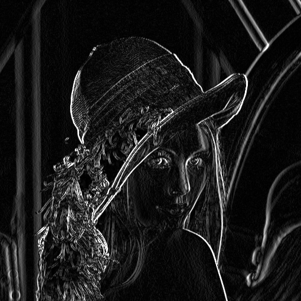
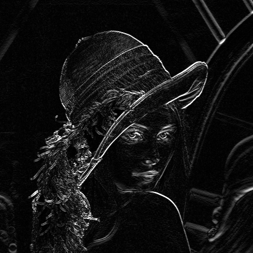
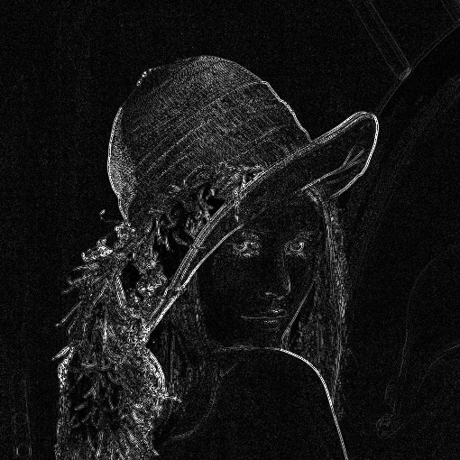

```python
!pip install pycuda
```

    Looking in indexes: https://pypi.org/simple, https://us-python.pkg.dev/colab-wheels/public/simple/
    Collecting pycuda
      Downloading pycuda-2022.1.tar.gz (1.7 MB)
         |████████████████████████████████| 1.7 MB 34.3 MB/s 
    [?25h  Installing build dependencies ... [?25l[?25hdone
      Getting requirements to build wheel ... [?25l[?25hdone
        Preparing wheel metadata ... [?25l[?25hdone
    Collecting mako
      Downloading Mako-1.2.1-py3-none-any.whl (78 kB)
         |████████████████████████████████| 78 kB 8.5 MB/s 
    [?25hRequirement already satisfied: appdirs>=1.4.0 in /usr/local/lib/python3.7/dist-packages (from pycuda) (1.4.4)
    Collecting pytools>=2011.2
      Downloading pytools-2022.1.12.tar.gz (70 kB)
         |████████████████████████████████| 70 kB 9.2 MB/s 
    [?25hCollecting platformdirs>=2.2.0
      Downloading platformdirs-2.5.2-py3-none-any.whl (14 kB)
    Requirement already satisfied: typing_extensions>=4.0 in /usr/local/lib/python3.7/dist-packages (from pytools>=2011.2->pycuda) (4.1.1)
    Requirement already satisfied: MarkupSafe>=0.9.2 in /usr/local/lib/python3.7/dist-packages (from mako->pycuda) (2.0.1)
    Requirement already satisfied: importlib-metadata in /usr/local/lib/python3.7/dist-packages (from mako->pycuda) (4.12.0)
    Requirement already satisfied: zipp>=0.5 in /usr/local/lib/python3.7/dist-packages (from importlib-metadata->mako->pycuda) (3.8.1)
    Building wheels for collected packages: pycuda, pytools
      Building wheel for pycuda (PEP 517) ... [?25l[?25hdone
      Created wheel for pycuda: filename=pycuda-2022.1-cp37-cp37m-linux_x86_64.whl size=629484 sha256=5cd5dfb81c24c1ac0e630dabcf4a6cca1de3eed20d44773a338d96b131cc6751
      Stored in directory: /root/.cache/pip/wheels/17/53/c9/caa05618e686df51f017d8a9923f38d915ce31df67ab6628e6
      Building wheel for pytools (setup.py) ... [?25l[?25hdone
      Created wheel for pytools: filename=pytools-2022.1.12-py2.py3-none-any.whl size=65034 sha256=f61013af77ec2735ce73314d251266769e9814cd7435c4b3bfd73a8086ce3932
      Stored in directory: /root/.cache/pip/wheels/37/5e/9e/76d7430e116b7cab0016fbabb26b896daae1946a3f7dea9915
    Successfully built pycuda pytools
    Installing collected packages: platformdirs, pytools, mako, pycuda
    Successfully installed mako-1.2.1 platformdirs-2.5.2 pycuda-2022.1 pytools-2022.1.12
    


```python
!nvcc --version
```

    nvcc: NVIDIA (R) Cuda compiler driver
    Copyright (c) 2005-2020 NVIDIA Corporation
    Built on Mon_Oct_12_20:09:46_PDT_2020
    Cuda compilation tools, release 11.1, V11.1.105
    Build cuda_11.1.TC455_06.29190527_0
    


```python
from google.colab import drive


drive.mount("/content/drive", force_remount=True)
```

    Mounted at /content/drive
    


```python
import numpy as np # to manipulated our matrices and vectors
import time # to measure time of execution in GPU and CPU
import cv2 # To load an image from drive to the notebook
from google.colab.patches import cv2_imshow # to see the image

# Clip pixel values of the image in range [0,255]
def to_img(m):
  return np.clip(np.absolute(m), 0, 255)

# Normalize kernel instead of doing it manually to our blurs
def nrm(m):
  m = np.array(m)
  return m/np.sum(np.abs(m))

# CREATE KERNELS
k_b = nrm([[1., 1., 1.], [1., 1., 1.], [1., 1., 1.]])          # Box blur
k_gb = nrm([[1., 2., 1.], [2., 4., 2.], [1., 2., 1.]])         # Gaussian blur
k_ve = np.array([[-1., 0., 1.], [-2., 0., 2.], [-1., 0., 1.]]) # Vertical edge detection
k_he = np.array([[-1., -2., -1.], [0., 0., 0.], [1., 2., 1.]]) # Horizontal edge detection
k_e = np.array([[-1.,-1.,-1.],[-1.,8.,-1.],[-1.,-1.,-1.]])     # Edge detection (vertical & horizontal edge detection)

# LOAD IMAGE
original = cv2.imread('/content/drive/My Drive/test.jpg', cv2.IMREAD_GRAYSCALE).astype(np.float32)
print("Original image:")
cv2_imshow(original)
```

    Original image:
    


    

    


```python
def cpu_convolve(a, b): # argument a is the image and argument b is the kernel
    
    image, kernel = [np.array(i).astype(np.float32) for i in [a, b]]
    
    # Calculate the dimensions for iteration over the pixels and weights
    iw, ih = image.shape[1], image.shape[0]
    mw, mh = kernel.shape[1], kernel.shape[0]

    if mw % 2 == 0 or mh % 2 == 0:
        print("Warning: Kernel dimensions not odd.")
    
    # calculate kernel radius
    pw = int((mw-1)/2)
    ph = int((mh-1)/2)

    # Output image shrinked by kernel radius since we are not zero padding. 2* because we will have loss from both sides
    fw = iw - 2*pw
    fh = ih - 2*ph
    
    # Filtered array
    filtered = np.zeros((fh, fw))
    
    # Iterate over image (shrinked by kernel radius)
    for y in range(fh):
        for x in range(fw):
            
            conv_sum = 0  # convolution output value
    
            # Iterate over kernel, (0,0) is the central pixel
            for ky in range(-ph, ph+1):
                for kx in range(-pw, pw+1):
                    
                    # Coordinates of pixel on original image, after horizontal and vertical flip 
                    # We can think of it as going from right to left, and from bottom to top in the non flipped image.
                    pixel_y = int(y - (ky - ph))
                    pixel_x = int(x - (kx - pw))
        
                    # Set value of pixel based on coordinates
                    pixel = image[pixel_y, pixel_x] 

                    # Get weight of this pixel from kernel matrix
                    # i.e. the number that this pixel will be multiplied by
                    weight = kernel[ky + ph, kx + pw]
    
                    # Sum up multiplications
                    conv_sum += pixel * weight
    
            # Set pixel at location (x,y) in output to sum of the weighed neighborhood
            filtered[y, x] = conv_sum
    
    return filtered
```


```python
# CPU

start_time = time.time()
filtered_image1_cpu = cpu_convolve(original, k_b)
print("\nBox blur:")
cv2_imshow(to_img(filtered_image1_cpu))

filtered_image2_cpu = cpu_convolve(original, k_gb)
print("\nGaussian blur:")
cv2_imshow(to_img(filtered_image2_cpu))

filtered_image3_cpu = cpu_convolve(original, k_ve)
print("\nVertical edge detection:")
cv2_imshow(to_img(filtered_image3_cpu))

filtered_image4_cpu = cpu_convolve(original, k_he)
print("\nHorizontal edge detection:")
cv2_imshow(to_img(filtered_image4_cpu))

filtered_image5_cpu = cpu_convolve(original, k_e)
print("\nEdge detection:")
cv2_imshow(to_img(filtered_image5_cpu))
end_time = time.time()

cpu_elapsed = end_time - start_time
print("Total CPU time: %.5f s" %cpu_elapsed)
```

    
    Box blur:
    


    

    


    
    Gaussian blur:
    


    

    


    
    Vertical edge detection:
    


    

    


    
    Horizontal edge detection:
    


    

    


    
    Edge detection:
    


    

    


    Total CPU time: 15.36259 s
    


```python
import pycuda.driver as cuda # for our CUDA api calls through python this time
import pycuda.autoinit # import to automatically persorm all the steps necessary to get cuda ready for submission of compute kernels
from pycuda.compiler import SourceModule # to open CUDA kernels from source, which is a .cu file

# DEVICE SETUP
BLOCK_SIZE = 32  # Max 32. 32**2 = 1024, max for GTX1060

# Compile kernel
mod = SourceModule(open("/content/drive/My Drive/kernel_v2.cu", "r").read())

# Get function conv
conv = mod.get_function("conv")

def gpu_convolve(in_img, mask):
  global BLOCK_SIZE
  global conv

  in_img, mask = [np.array(i).astype(np.float32) for i in [in_img, mask]]

  # Matrix input (image)
  inw = np.int32(in_img.shape[1]) # Width of input matrix 
  inh = np.int32(in_img.shape[0]) # Height of input matrix

  #print("Image width: " +str(inw))
  #print("Image height: " +str(inh))

  # Matrix mask (kernel)
  mw = np.int32(mask.shape[1]) # Width of mask matrix
  if mw % 2 == 0:
    print("Kernel width not an odd number!")
  mh = np.int32(mask.shape[0]) # Height of mask matrix
  if mh % 2 == 0:
    print("Kernel height not an odd number!")

  # calculate kernel radius
  pw = int((mw-1)/2)
  ph = int((mh-1)/2)

  # Matrix output, subtract 2*kernel radius, *2 because it's taken off both sides

  #out_img = np.empty([inh-(mh-1), inw-(mw-1)])
  #out_img = out_img.astype(np.float32)

  out_img = np.empty([inh-(2*ph), inw-(2*pw)])
  out_img = out_img.astype(np.float32)

  # Allocate memory on device
  in_img_gpu = cuda.mem_alloc(in_img.nbytes)
  mask_gpu = cuda.mem_alloc(mask.nbytes)
  out_img_gpu = cuda.mem_alloc(out_img.nbytes)

  # Copy matrices to memory (host to device)
  cuda.memcpy_htod(in_img_gpu, in_img)
  cuda.memcpy_htod(mask_gpu, mask)

  # Set grid size from input matrix
  #grid = (int(inw/BLOCK_SIZE+(0 if inw % BLOCK_SIZE is 0 else 1)),
          #int(inh/BLOCK_SIZE+(0 if inh % BLOCK_SIZE is 0 else 1)),
          #1)
  
  grid = (int(inw/BLOCK_SIZE),
          int(inh/BLOCK_SIZE),
          1)

  # Call gpu conv function
  conv(in_img_gpu, mask_gpu, inw, inh, mw, mh, out_img_gpu, block=(BLOCK_SIZE, BLOCK_SIZE, 1), grid=grid)
  # print(grid)

  # Copyt bach the result
  cuda.memcpy_dtoh(out_img, out_img_gpu)

  # Free memory
  in_img_gpu.free()
  mask_gpu.free()
  out_img_gpu.free()

  # Return the result
  return out_img
```


```python
# GPU

start_time = time.time()
filtered_image1_gpu = gpu_convolve(original, k_b)
print("\nBox blur:")
cv2_imshow(to_img(filtered_image1_gpu))

filtered_image2_gpu = gpu_convolve(original, k_gb)
print("\nGaussian blur:")
cv2_imshow(to_img(filtered_image2_gpu))

filtered_image3_gpu = gpu_convolve(original, k_ve)
print("\nVertical edge detection:")
cv2_imshow(to_img(filtered_image3_gpu))

filtered_image4_gpu = gpu_convolve(original, k_he)
print("\nHorizontal edge detection:")
cv2_imshow(to_img(filtered_image4_gpu))

filtered_image5_gpu = gpu_convolve(original, k_e)
print("\nEdge detection:")
cv2_imshow(to_img(filtered_image5_gpu))
end_time = time.time()

gpu_elapsed = end_time - start_time
print("Total GPU time: %.5f s" %gpu_elapsed)
```

    
    Box blur:
    


    

    


    
    Gaussian blur:
    


    

    


    
    Vertical edge detection:
    


    

    


    
    Horizontal edge detection:
    


    

    


    
    Edge detection:
    


    

    


    Total GPU time: 0.24858 s
    


```python
print("GPU is %.2f times faster than the CPU" %(cpu_elapsed/gpu_elapsed))
print()

print(filtered_image5_gpu)
print("-------------------------------")
print(filtered_image5_cpu)

error = np.sum(filtered_image5_gpu - filtered_image5_cpu)
print()
print("Error: " +str(error))
```

    GPU is 61.80 faster that CPU
    
    [[-14.  12. -15. ...  -5. -37. -24.]
     [  4.  -8.  -6. ... -30. -44. -42.]
     [ 15.   0.   4. ... -15.  -9. -57.]
     ...
     [ -4.  -6.   0. ...  14. -16.   9.]
     [-23. -12.   1. ...  19.  -4.  -8.]
     [ -4.  -6. -14. ... -11. -15.  -1.]]
    -------------------------------
    [[-14.  12. -15. ...  -5. -37. -24.]
     [  4.  -8.  -6. ... -30. -44. -42.]
     [ 15.   0.   4. ... -15.  -9. -57.]
     ...
     [ -4.  -6.   0. ...  14. -16.   9.]
     [-23. -12.   1. ...  19.  -4.  -8.]
     [ -4.  -6. -14. ... -11. -15.  -1.]]
    
    Error: 0.0
    


```python

```
