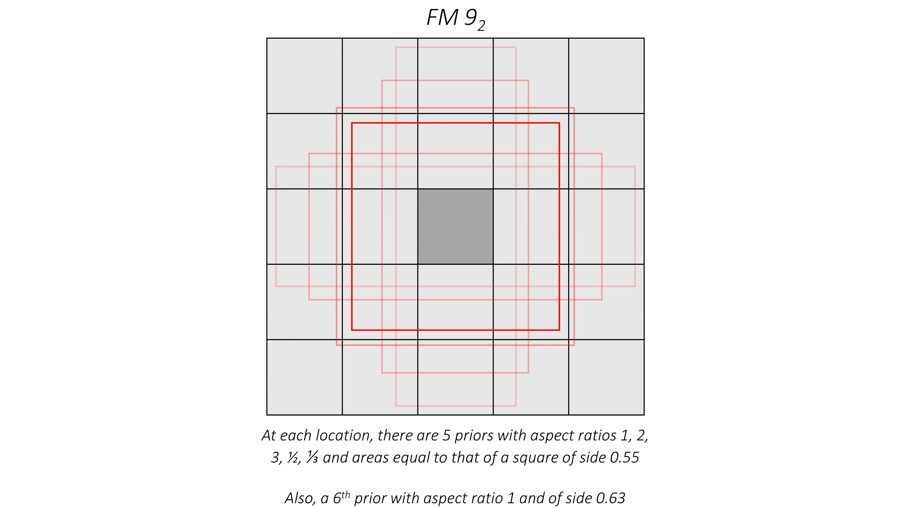

# Single Shot Detection in Pytorch

---

## Exercise Goals

The goal of this exercise is to understand the core functionalities of a Deep Learning (DL) based Object Detector, using the Single Shot Detector (SSD) paradigm. Although only the SSD architecture is studied, many concepts are shared amongst other DL-based detectors, such as YOLO, Faster R-CNN and other more recently proposed algorithms.

To achieve this, we will begin to build the entire SSD algorithm step-by-step, including developing and understanding the base network, the detection head network, the priors (or anchors or default boxes), the dataset and data processing methods, as well as the final training, detection and evaluation methods.

We will be following the code from https://github.com/sgrvinod/a-PyTorch-Tutorial-to-Object-Detection/ and referring to some explanatory images. This code constitues the final solution to the exercise.


## Pytorch Basics

We will be mostly dealing with 2D Convolutional and Max Pooling layers, as well as with Rectified Linear Units (ReLU) non-linearities (i.e., activation functions). 


```python
# we need the nn package from torch, as well as the functional package from the nn package which we typically abbreviate as F
import torch
from torch import nn
import torch.nn.functional as F

# now to build a very basic feature extraction network
# (this is one way to do it - keeping it simple)

class MyFeatureExtractor(nn.Module):
  # subclass of the nn.Module superclass so that pytorch knows how to handle it (very important for backpropagation of loss gradient)
  def __init__(self, in_channels, out_channels):
    super(MyFeatureExtractor, self).__init__()
    # call to super is required for correct initialization
    # now let's make our layers
    self.conv = nn.Conv2d(in_channels, out_channels, kernel_size=3, padding=1, stride=1)
    self.pool = nn.MaxPool2d(kernel_size=2, stride=2)
    # that's it, one convolutional and one max pooling layer

  def forward(self, x):
    # x is the input tensor, whose depth dimension must be in_channels or we can't forward pass
    x = self.conv(x)  # forward x in the conv layer, name output x (typical)
    # at this point, normally we want to apply the ReLU function, so:
    x = F.relu(x)     # using the functional API (typical for activation functions)
    x = self.pool(x)  # forward x in the max layer, name it x again
    # don't forget to return the result
    return x

x = torch.ones(1, 3, 300, 300)
net = MyFeatureExtractor(in_channels=3, out_channels=64)

out = net(x)
print(out.size())

```

    torch.Size([1, 64, 150, 150])
    

To train a model we basically need the following:


1.   A dataset (`torch.utils.data.Dataset`). Let's assume our dataset returns tuples of the form `(data, target)` where data is an image tensor and target is a classification label.
2.   A dataloader (`torch.utils.data.DataLoader`). The data loader's job is to load the data from our dataset in an efficient manner. This is where the `batch_size` is defined and used.
3. A loss function. Also known as criterion or objective function, for example in classification tasks, `nn.CrossEntropy` is typically used. In this case, our model's prediction is a tensor containing "probabilities" that each input sample belongs to each of the classes. The prediction is then compared against the target to produce the final loss.
4. An optimizer. For example, `torch.optim.SGD` or Stochastic Gradient Descent


Here's what a training loop looks like for one epoch:
```
# example in pseudocode

for i, (data, target) in enumerate(dataloader):
  # Forward prop.
  pred = model(data)

  # Loss
  loss = criterion(pred, target)

  # Backward prop.
  optimizer.zero_grad()
  loss.backward()

  # Update model
  optimizer.step()
```


```python
#TODO: your input here
#Exercise: create a feature extractor containing two blocks of layers.
#Each block should consist of two convolutional layers and one 2-strided maxpooling layer.
#(name them conv1_1, conv1_2, pool1, conv2_1, conv2_2, pool2)
#You can use any parameters you want (out_channels, kernel_size, padding, dilation)
#Each forward pass of a convolutional layer should be followed by a ReLU nonlinearity.
#Finally forward pass an (8, 3, 300, 300) tensor filled with ones through the network.
#Print the size of the resulting tensor.

class MyExample(nn.Module):
    def __init__(self):
      super(MyExample, self).__init__()
      self.conv1_1 = 
      self.conv1_2 = 
      self.pool1 = 

      self.conv2_1 = 
      self.conv2_2 = 
      self.pool2 = 

    def forward(self, x):
      x = self.conv1_1(x)
      x = F.relu(x)
      x = F.relu(self.conv1_2(x))
      x = self.pool1(x)

      x = F.relu(self.conv2_1(x))
      x = F.relu(self.conv2_2(x))
      x = self.pool2(x)
      return x

test_x = torch.ones(8, 3, 300, 300)
net = MyExample()
out = net(test_x)
out.size()


```


    torch.Size([8, 256, 75, 75])


## Single Shot Detector

Core concepts of SSD:


1.   Input data: one important aspect of the input data, is the size of the images used. For this exercise we will focus on the SSD300 version, i.e., input images will be resized to 300x300 before being fed to the network. Another important part is the bounding boxes and their labels, i.e., the coordinates and class of each box (keep in mind also that each image has a different number of depicted objects)
2.   Multiscale feature maps for detection: As the 300x300 input image is forwarded through the layers of the network, its spatial dimensions are subsampled, via strided `nn.MaxPool2d` or `nn.Conv2d` layers.


Let's start by downloading the source code which contains all the files we need to perform Object Detection with Pytorch, using the VOC dataset (or a subset of it for speed's sake), i.e., the complete final solution to this exercise.


```python
%%shell
# ssd300.zip is a 571KB file
wget --no-check-certificate 'https://docs.google.com/uc?export=download&id=1uzhae3N81Fvz9Z1wl5r4Wr3tNMGOXbep' -O ssd300.zip
unzip ssd300.zip
ls
```

    --2021-08-26 07:14:51--  https://docs.google.com/uc?export=download&id=1uzhae3N81Fvz9Z1wl5r4Wr3tNMGOXbep
    Resolving docs.google.com (docs.google.com)... 74.125.133.102, 74.125.133.138, 74.125.133.113, ...
    Connecting to docs.google.com (docs.google.com)|74.125.133.102|:443... connected.
    HTTP request sent, awaiting response... 302 Moved Temporarily
    Location: https://doc-00-4k-docs.googleusercontent.com/docs/securesc/ha0ro937gcuc7l7deffksulhg5h7mbp1/dcovepfjvtjcd7kfasouh3alu55p8v7s/1629962025000/02871571857746379791/*/1uzhae3N81Fvz9Z1wl5r4Wr3tNMGOXbep?e=download [following]
    Warning: wildcards not supported in HTTP.
    --2021-08-26 07:14:52--  https://doc-00-4k-docs.googleusercontent.com/docs/securesc/ha0ro937gcuc7l7deffksulhg5h7mbp1/dcovepfjvtjcd7kfasouh3alu55p8v7s/1629962025000/02871571857746379791/*/1uzhae3N81Fvz9Z1wl5r4Wr3tNMGOXbep?e=download
    Resolving doc-00-4k-docs.googleusercontent.com (doc-00-4k-docs.googleusercontent.com)... 74.125.71.132, 2a00:1450:400c:c02::84
    Connecting to doc-00-4k-docs.googleusercontent.com (doc-00-4k-docs.googleusercontent.com)|74.125.71.132|:443... connected.
    HTTP request sent, awaiting response... 200 OK
    Length: unspecified [application/zip]
    Saving to: ‘ssd300.zip’
    
    ssd300.zip              [ <=>                ]   2.78M  --.-KB/s    in 0.02s   
    
    2021-08-26 07:14:52 (151 MB/s) - ‘ssd300.zip’ saved [2913355]
    
    Archive:  ssd300.zip
      inflating: calibril.ttf            
      inflating: create_data_lists.py    
      inflating: datasets.py             
      inflating: detect.py               
      inflating: eval.py                 
      inflating: label_map.json          
      inflating: LICENSE                 
      inflating: model.py                
      inflating: train.py                
      inflating: utils.py                
      inflating: auxconv.jpg             
      inflating: modifiedvgg.PNG         
      inflating: vgg16.PNG               
      inflating: priors1.jpg             
      inflating: ecs2.PNG                
    auxconv.jpg	      detect.py       LICENSE	       sample_data  vgg16.PNG
    calibril.ttf	      ecs2.PNG	      model.py	       ssd300.zip
    create_data_lists.py  eval.py	      modifiedvgg.PNG  train.py
    datasets.py	      label_map.json  priors1.jpg      utils.py
    


    


```python
%%shell
# VOCdevkit.zip contains a subsample of the VOC dataset, the file is 234MB
wget --load-cookies /tmp/cookies.txt "https://docs.google.com/uc?export=download&confirm=$(wget --quiet --save-cookies /tmp/cookies.txt --keep-session-cookies --no-check-certificate 'https://docs.google.com/uc?export=download&id=1bk78yE6XaWzOHDgs1sg3OwutS8R6oCC4' -O- | sed -rn 's/.*confirm=([0-9A-Za-z_]+).*/\1\n/p')&id=1bk78yE6XaWzOHDgs1sg3OwutS8R6oCC4" -O VOCdevkit.zip
unzip -qq VOCdevkit.zip 
ls
```

    --2021-08-26 07:14:57--  https://docs.google.com/uc?export=download&confirm=Ne&id=1bk78yE6XaWzOHDgs1sg3OwutS8R6oCC4
    Resolving docs.google.com (docs.google.com)... 74.125.133.138, 74.125.133.102, 74.125.133.113, ...
    Connecting to docs.google.com (docs.google.com)|74.125.133.138|:443... connected.
    HTTP request sent, awaiting response... 200 OK
    Length: unspecified [text/html]
    Saving to: ‘VOCdevkit.zip’
    
    
VOCdevkit.zip           [<=>                 ]       0  --.-KB/s               
VOCdevkit.zip           [ <=>                ]   3.21K  --.-KB/s    in 0s      
    
    2021-08-26 07:14:58 (41.3 MB/s) - ‘VOCdevkit.zip’ saved [3284]
    
    [VOCdevkit.zip]
      End-of-central-directory signature not found.  Either this file is not
      a zipfile, or it constitutes one disk of a multi-part archive.  In the
      latter case the central directory and zipfile comment will be found on
      the last disk(s) of this archive.
    unzip:  cannot find zipfile directory in one of VOCdevkit.zip or
            VOCdevkit.zip.zip, and cannot find VOCdevkit.zip.ZIP, period.
    auxconv.jpg	      ecs2.PNG	      modifiedvgg.PNG  utils.py
    calibril.ttf	      eval.py	      priors1.jpg      vgg16.PNG
    create_data_lists.py  label_map.json  sample_data      VOCdevkit.zip
    datasets.py	      LICENSE	      ssd300.zip
    detect.py	      model.py	      train.py
    


    


## Source feature map extraction

SSD300 uses the VGG16 network for feature extraction, after converting the fully connected layers to convolutional. Let's review its architecture (note that when it was proposed for classification, a 224x224 input size was used):


```python
from PIL import Image
Image.open('vgg16.PNG')
```


    

    


Notice that it consists of five blocks of convolutional (green) layers, followed by 2-stride max pooling layers, and 2 linear (fully connected, blue) layers before the final classification layers (mapping each 4096D representation to the 1000 classes of the ImageNet dataset).

Our goal now is to make use of a pretrained VGG16 model (provided by pytorch) for our task. The following changes are made:


1.   The classification layer (fc8) is not needed
2.   Each max pooling layer halves the spatial dimensions of its input, i.e., for a 300x300 input size, the dimension becomes 150x150 and 75x75 after the first and second max pooling layers. The next max pooling layer would result in a 37x37 feature map, whereas we want it to be 38x38 (per the SSD paper). To achieve this, we need to pass the `ceil_mode=True` parameter of this layer.
3. The fifth max pooling layer now has `kernel=3, stride=1, padding=1` so as to not halve the spatial dimension.
4. fc6 and fc7 are converted to convolutional layers conv6 and conv7, each with `1024` filters. For conv6, `kernel_size=3, padding=6, dilation=6`, and for conv7, `kernel_size=1`.

Keep in mind that the base network is responsible for producing two of the six source feature maps, one of size 38x38(x512) and one of size 19x19(x1024).

The base network now looks like this:


```python
Image.open('modifiedvgg.PNG')
```


    

    


Now let's build it!


```python
class VGGBase(nn.Module):
    """
    VGG base convolutions to produce lower-level feature maps.
    """

    def __init__(self):
        super(VGGBase, self).__init__()

        # Standard convolutional layers in VGG16
        self.conv1_1 = nn.Conv2d(3, 64, kernel_size=3, padding=1)  # stride = 1, by default
        self.conv1_2 = nn.Conv2d(64, 64, kernel_size=3, padding=1)
        self.pool1 = nn.MaxPool2d(kernel_size=2, stride=2)

        # TODO: your input is needed here
        self.conv2_1 = 
        self.conv2_2 = 
        self.pool2 = 

        self.conv3_1 = 
        self.conv3_2 = 
        self.conv3_3 = 
        # remember to set ceil_mode to True
        self.pool3 = 

        self.conv4_1 = 
        self.conv4_2 = 
        self.conv4_3 = 
        self.pool4 = 

        self.conv5_1 = 
        self.conv5_2 = 
        self.conv5_3 = 
        # remember to change kernel size, stride and padding to retain spatial dims
        self.pool5 = 

        # Replacements for FC6 and FC7 in VGG16
        self.conv6 = nn.Conv2d(512, 1024, kernel_size=3, padding=6, dilation=6)

        self.conv7 = nn.Conv2d(1024, 1024, kernel_size=1)

    def forward(self, image):
        """
        Forward propagation.

        :param image: images, a tensor of dimensions (N, 3, 300, 300)
        :return: lower-level feature maps conv4_3 and conv7
        """
        # conv1_1, conv1_2, pool1
        # don't forget to use F.relu after each conv
        out = F.relu(self.conv1_1(image))    # (N, 64, 300, 300)
        out = F.relu(self.conv1_2(out))    # (N, 64, 300, 300)
        out = self.pool1(out)    # (N, 64, 150, 150)
        print(out.size())

        # conv2_1, conv2_2, pool2
        out =     # (N, 128, 150, 150)
        out =     # (N, 128, 150, 150)
        out =     # (N, 128, 75, 75)
        print(out.size())

        # conv3_1, conv3_2, conv3_3, pool3
        out =     # (N, 256, 75, 75)
        out =     # (N, 256, 75, 75)
        out =     # (N, 256, 75, 75)
        out =     # (N, 256, 38, 38), it would have been 37 if not for ceil_mode = True in pool3
        print(out.size())

        # conv4_1, conv4_2, pool4
        out =     # (N, 512, 38, 38)
        out =     # (N, 512, 38, 38)
        out =     # (N, 512, 38, 38)
        # next line is necessary in order to keep the source map in tact
        # so as to return it along with final one
        # then apply the pooling layer to `out` tensor
        conv4_3_feats = out  # (N, 512, 38, 38)
        out = self.pool4(out)    # (N, 512, 19, 19)
        print(out.size())

        # conv5_1, conv5_2, conv5_3, pool5
        out = F.relu(self.conv5_1(out))    # (N, 512, 19, 19)
        out = F.relu(self.conv5_2(out))    # (N, 512, 19, 19)
        out = F.relu(self.conv5_3(out))    # (N, 512, 19, 19)
        out = self.pool5(out)    # (N, 512, 19, 19), pool5 does not reduce dimensions
        print(out.size())

        # conv6
        out =  F.relu(self.conv6(out))   # (N, 1024, 19, 19)
        print(out.size())

        # conv7
        conv7_feats = F.relu(self.conv7(out))  # (N, 1024, 19, 19)
        print(out.size())

        # Lower-level feature maps
        return conv4_3_feats, conv7_feats
```

Let's test it:


```python
# leave the following line commented to use your solution
# from model import VGGBase

x = torch.ones(1, 3, 300, 300)
base = VGGBase()
conv4_3_feats, conv7_feats = base(x)
# the sizes should be torch.Size([1, 512, 38, 38]) torch.Size([1, 1024, 19, 19])
# if not, uncomment the import on line 2
print(conv4_3_feats.size(), conv7_feats.size())
```

    torch.Size([1, 64, 150, 150])
    torch.Size([1, 128, 75, 75])
    torch.Size([1, 256, 38, 38])
    torch.Size([1, 512, 19, 19])
    torch.Size([1, 512, 19, 19])
    torch.Size([1, 1024, 19, 19])
    torch.Size([1, 1024, 19, 19])
    torch.Size([1, 512, 38, 38]) torch.Size([1, 1024, 19, 19])
    

Moving on to the auxiliary layers, i.e., the additional convolutional layer blocks which will help us extract the remaining source feature maps. Here's what they look like:


```python
Image.open('auxconv.jpg')
```


    

    


Let's build this module as well. Notice the following:


1.   The kernel size alternates between 3 and 1 for consecutive layers.
2.   The padding sizes are 0, 1, 0, 1, 0, 0, 0, 0.
3. The layers with `padding=1` are strided, i.e., `stride=2`.


```python
class AuxiliaryConvolutions(nn.Module):
    """
    Additional convolutions to produce higher-level feature maps.
    """

    def __init__(self):
        super(AuxiliaryConvolutions, self).__init__()
        # Auxiliary/additional convolutions on top of the VGG base
        # TODO: your input is required
        # note: the input size for the first convolutional layer is equal to the depth dimension of the conv7 source map
        self.conv8_1 = 
        self.conv8_2 = 

        self.conv9_1 = 
        self.conv9_2 = 

        self.conv10_1 = 
        self.conv10_2 = 

        self.conv11_1 = 
        self.conv11_2 = 

    def forward(self, conv7_feats):
        """
        Forward propagation.

        :param conv7_feats: lower-level conv7 feature map, a tensor of dimensions (N, 1024, 19, 19)
        :return: higher-level feature maps conv8_2, conv9_2, conv10_2, and conv11_2
        """
        # conv8_1, conv8_2, don't forget 1. use ReLU, 2. keep conv8_2_feats etc. as variables
        out =     # (N, 256, 19, 19)
        out =     # (N, 512, 10, 10)


        # conv9_1, conv9_2
        out =     # (N, 128, 10, 10)
        out =     # (N, 256, 5, 5)


        # conv10_1, conv10_2
        out =     # (N, 128, 5, 5)
        out =     # (N, 256, 3, 3)


        # conv11_1, conv11_2
        out =     # (N, 128, 3, 3)
        out =     # (N, 256, 1, 1)
        

        # Higher-level feature maps
        return conv8_2_feats, conv9_2_feats, conv10_2_feats, conv11_2_feats
```

Let's test this as well:


```python
# leave the following line commented to use your solution
from model import AuxiliaryConvolutions

auxconv = AuxiliaryConvolutions()
conv8_2_feats, conv9_2_feats, conv10_2_feats, conv11_2_feats = auxconv(conv7_feats)
# the sizes should be torch.Size([1, 512, 10, 10]) torch.Size([1, 256, 5, 5]) torch.Size([1, 256, 3, 3]) torch.Size([1, 256, 1, 1])
# if not, uncomment the import on line 2
print(conv8_2_feats.size(), conv9_2_feats.size(), conv10_2_feats.size(), conv11_2_feats.size())
```

    torch.Size([1, 512, 10, 10]) torch.Size([1, 256, 5, 5]) torch.Size([1, 256, 3, 3]) torch.Size([1, 256, 1, 1])
    

## Prior box calculation

Now that we have our source feature maps, it is time to move on to the calculation of the prior boxes for each one. The prior boxes can be thought of as a helping bias for the network, in the sense that they provide the network with some sense of what it should be able to predict. Here's how to calculate them:

1.   We define a scale `s_k` for each of the `k` source feature maps. Then each box for that source has an area of `s_k` squared.
2.   We define 2 or 3 aspect ratios for each source map, so as to provide priors which are more diverse: (1, 2, 3) or (1, 2). For aspect ratios 2, 3 we create two boxes for each, corresponding to rectangular boxes with horizontal or vertical orientation. To do this, we multiply one side and divide the other one with the aspect ratio.
3. For aspect ratio = 1 (i.e., square box), we define two boxes per source: one with spatial dimensions equal to `s_k` and one extra prior with spatial dimensions equal to the geometric mean (i.e., square root of product) of `s_k` and `s_(k+1)`.
4. Thus, 4 or 6 different prior spatial dimensions are defined per source map. These correspond to 4 or 6 boxes which are **tiled** in a regular grid fashion, in each cell of each of the source maps.

| Feature Map From | Feature Map Dimensions | Prior Scale | Aspect Ratios | Number of Priors per Position | Total Number of Priors on this Feature Map |
| :-----------: | :-----------: | :-----------: | :-----------: | :-----------: | :-----------: |
| `conv4_3`      | 38, 38       | 0.1 | 1:1, 2:1, 1:2 + an extra prior | 4 | 5776 |
| `conv7`      | 19, 19       | 0.2 | 1:1, 2:1, 1:2, 3:1, 1:3 + an extra prior | 6 | 2166 |
| `conv8_2`      | 10, 10       | 0.375 | 1:1, 2:1, 1:2, 3:1, 1:3 + an extra prior | 6 | 600 |
| `conv9_2`      | 5, 5       | 0.55 | 1:1, 2:1, 1:2, 3:1, 1:3 + an extra prior | 6 | 150 |
| `conv10_2`      | 3,  3       | 0.725 | 1:1, 2:1, 1:2 + an extra prior | 4 | 36 |
| `conv11_2`      | 1, 1       | 0.9 | 1:1, 2:1, 1:2 + an extra prior | 4 | 4 |
| **Grand Total**      |    –    | – | – | – | **8732 priors** |

Here's what the priors for conv9_2 source look like (for the central cell):


```python
Image.open('priors1.jpg')
```


    

    


Let's create them!


```python
def create_prior_boxes():
    """
    Create the 8732 prior (default) boxes for the SSD300, as defined in the paper.

    :return: prior boxes in center-size coordinates, a tensor of dimensions (8732, 4)
    """
    fmap_dims = {'conv4_3': 38,
                 'conv7': 19,
                 'conv8_2': 10,
                 'conv9_2': 5,
                 'conv10_2': 3,
                 'conv11_2': 1}

    obj_scales = {'conv4_3': 0.1,
                  'conv7': 0.2,
                  'conv8_2': 0.375,
                  'conv9_2': 0.55,
                  'conv10_2': 0.725,
                  'conv11_2': 0.9}

    aspect_ratios = {'conv4_3': [1., 2., 0.5],
                     'conv7': [1., 2., 3., 0.5, .333],
                     'conv8_2': [1., 2., 3., 0.5, .333],
                     'conv9_2': [1., 2., 3., 0.5, .333],
                     'conv10_2': [1., 2., 0.5],
                     'conv11_2': [1., 2., 0.5]}

    fmaps = list(fmap_dims.keys())

    prior_boxes = []

    for k, fmap in enumerate(fmaps):
        for i in range(fmap_dims[fmap]):
            for j in range(fmap_dims[fmap]):
                # the priors are return in (cx, cy, w, h) format
                # first let's find cx, cy
                cx = (j + 0.5)
                cy = (i + 0.5)
                # normalize to (0, 1)
                cx /= fmap_dims[fmap]
                cy /= fmap_dims[fmap]

                for ratio in aspect_ratios[fmap]:
                    # TODO: your input here
                    w = obj_scales[fmap] * ratio
                    h = obj_scales[fmap] / ratio
                    prior_boxes.append([cx, cy, w, h])

                    # For an aspect ratio of 1, use an additional prior whose scale is the geometric mean of the
                    # scale of the current feature map and the scale of the next feature map
                    if ratio == 1.:
                        if k == len(fmaps) - 1:
                            # for the last feature map, as there is no s_(k+1) we use w = h = 1.
                            w = 1.
                            h = 1.
                        else:
                            # TODO: your input here
                            w = sqrt(obj_scales[fmap] * obj_scales[fmaps[k+1]])
                            h = sqrt(obj_scales[fmap] * obj_scales[fmaps[k+1]])
                        prior_boxes.append([cx, cy, w, h])

    prior_boxes = torch.FloatTensor(prior_boxes)  # (8732, 4)
    prior_boxes.clamp_(0, 1)  # (8732, 4)

    return prior_boxes
```


```python
# let's test it
# from utils import create_prior_boxes
from math import sqrt
prior_boxes = create_prior_boxes()
prior_boxes.size(), prior_boxes.min(), prior_boxes.max()
# should be: (torch.Size([8732, 4]), tensor(0.0132), tensor(1.))
```


    (torch.Size([8732, 4]), tensor(0.0132), tensor(1.))


## Prediction Convolutions

We're ready to create the detection head, i.e., the convolutional layers which perform detection. We need two convolutional layers for each of the source maps, one to predict bounding boxes offsets and one for classification. Here's how to do this:


1.   To keep things simple, all of the layers will have `kernel_size=3, padding=1`. Thus, the spatial dimensions are preserved.
2.   The input channels should be equal to the depth dimension of each of the source maps, i.e., 512, 1024, 512, 256, 256, 256.
4. The output channels for the *regression* layers should be equal to `n_anchors_k` * 4, as we need to predict 4 values (x, y, w, h offsets) for each prior box. 
5. The output channels for the *classification* layers should be equal to `n_anchors_k` * `(n_classes + 1)` where a background class is added to the dataset. Boxes which have no corresponding groundtruth are set to the background class. These boxes are called **negative examples**.


```python
class PredictionConvolutions(nn.Module):
    """
    Convolutions to predict class scores and bounding boxes using lower and higher-level feature maps.

    The bounding boxes (locations) are predicted as encoded offsets w.r.t each of the 8732 prior (default) boxes.
    See 'cxcy_to_gcxgcy' in utils.py for the encoding definition.

    The class scores represent the scores of each object class in each of the 8732 bounding boxes located.
    A high score for 'background' = no object.
    """

    def __init__(self, n_classes):
        """
        :param n_classes: number of different types of objects
        """
        super(PredictionConvolutions, self).__init__()

        self.n_classes = n_classes

        # Number of prior-boxes we are considering per position in each feature map
        n_boxes = {'conv4_3': 4,
                   'conv7': 6,
                   'conv8_2': 6,
                   'conv9_2': 6,
                   'conv10_2': 4,
                   'conv11_2': 4}
        # 4 prior-boxes implies we use 4 different aspect ratios, etc.

        # Localization prediction convolutions (predict offsets w.r.t prior-boxes)
        # TODO: your input here
        self.loc_conv4_3 = 
        self.loc_conv7 = 
        self.loc_conv8_2 = 
        self.loc_conv9_2 = 
        self.loc_conv10_2 = 
        self.loc_conv11_2 = 

        # Class prediction convolutions (predict classes in localization boxes)
        # TODO: your input here
        self.cl_conv4_3 = 
        self.cl_conv7 = 
        self.cl_conv8_2 = 
        self.cl_conv9_2 = 
        self.cl_conv10_2 = 
        self.cl_conv11_2 = 

    def forward(self, conv4_3_feats, conv7_feats, conv8_2_feats, conv9_2_feats, conv10_2_feats, conv11_2_feats):
        """
        Forward propagation.

        :param conv4_3_feats: conv4_3 feature map, a tensor of dimensions (N, 512, 38, 38)
        :param conv7_feats: conv7 feature map, a tensor of dimensions (N, 1024, 19, 19)
        :param conv8_2_feats: conv8_2 feature map, a tensor of dimensions (N, 512, 10, 10)
        :param conv9_2_feats: conv9_2 feature map, a tensor of dimensions (N, 256, 5, 5)
        :param conv10_2_feats: conv10_2 feature map, a tensor of dimensions (N, 256, 3, 3)
        :param conv11_2_feats: conv11_2 feature map, a tensor of dimensions (N, 256, 1, 1)
        :return: 8732 locations and class scores (i.e. w.r.t each prior box) for each image
        """
        batch_size = conv4_3_feats.size(0)

        # Predict localization boxes' bounds (as offsets w.r.t prior-boxes)
        l_conv4_3 = self.loc_conv4_3(conv4_3_feats)  # (N, 16, 38, 38)
        l_conv4_3 = l_conv4_3.permute(0, 2, 3, 1).contiguous()  # (N, 38, 38, 16), to match prior-box order (after .view())
        # (.contiguous() ensures it is stored in a contiguous chunk of memory, needed for .view() below)
        l_conv4_3 = l_conv4_3.view(batch_size, -1, 4)  # (N, 5776, 4), there are a total 5776 boxes on this feature map

        # TODO: your input here
        l_conv7 =                                     # forward pass (N, 24, 19, 19)
        l_conv7 =                                     # permute, contiguous (N, 19, 19, 24)
        l_conv7 =                                     # view as (N, 2166, 4), there are a total 2116 boxes on this feature map

        l_conv8_2 =                                   # (N, 24, 10, 10)
        l_conv8_2 =                                   # (N, 10, 10, 24)
        l_conv8_2 =                                   # (N, 600, 4)

        l_conv9_2 =                                   # (N, 24, 5, 5)
        l_conv9_2 =                                   # (N, 5, 5, 24)
        l_conv9_2 =                                   # (N, 150, 4)

        l_conv10_2 =                                  # (N, 16, 3, 3)
        l_conv10_2 =                                  # (N, 3, 3, 16)
        l_conv10_2 =                                  # (N, 36, 4)

        l_conv11_2 =                                  # (N, 16, 1, 1)
        l_conv11_2 =                                  # (N, 1, 1, 16)
        l_conv11_2 =                                  # (N, 4, 4)

        # Predict classes in localization boxes
        c_conv4_3 = self.cl_conv4_3(conv4_3_feats)  # (N, 4 * n_classes, 38, 38)
        c_conv4_3 = c_conv4_3.permute(0, 2, 3, 1).contiguous()  # (N, 38, 38, 4 * n_classes), to match prior-box order (after .view())
        c_conv4_3 = c_conv4_3.view(batch_size, -1, self.n_classes)  # (N, 5776, n_classes), there are a total 5776 boxes on this feature map

        c_conv7 =                     # (N, 6 * n_classes, 19, 19)
        c_conv7 =                     # (N, 19, 19, 6 * n_classes)
        c_conv7 =                     # (N, 2166, n_classes), there are a total 2116 boxes on this feature map

        c_conv8_2 =                   # (N, 6 * n_classes, 10, 10)
        c_conv8_2 =                   # (N, 10, 10, 6 * n_classes)
        c_conv8_2 =                   # (N, 600, n_classes)

        c_conv9_2 =                   # (N, 6 * n_classes, 5, 5)
        c_conv9_2 =                   # (N, 5, 5, 6 * n_classes)
        c_conv9_2 =                   # (N, 150, n_classes)

        c_conv10_2 =                  # (N, 4 * n_classes, 3, 3)
        c_conv10_2 =                  # (N, 3, 3, 4 * n_classes)
        c_conv10_2 =                  # (N, 36, n_classes)

        c_conv11_2 =                  # (N, 4 * n_classes, 1, 1)
        c_conv11_2 =                  # (N, 1, 1, 4 * n_classes)
        c_conv11_2 =                  # (N, 4, n_classes)

        # A total of 8732 boxes
        # Concatenate in this specific order (i.e. must match the order of the prior-boxes)
        locs = torch.cat([l_conv4_3, l_conv7, l_conv8_2, l_conv9_2, l_conv10_2, l_conv11_2], dim=1)  # (N, 8732, 4)
        classes_scores = torch.cat([c_conv4_3, c_conv7, c_conv8_2, c_conv9_2, c_conv10_2, c_conv11_2],
                                   dim=1)  # (N, 8732, n_classes)

        return locs, classes_scores
```


```python
# now to test it
from model import PredictionConvolutions
pred_convs = PredictionConvolutions(21)
locs, classes_scores = pred_convs(conv4_3_feats, conv7_feats, conv8_2_feats, conv9_2_feats, conv10_2_feats, conv11_2_feats)
locs.size(), classes_scores.size()
# should be (torch.Size([1, 8732, 4]), torch.Size([1, 8732, 21]))
```


    (torch.Size([1, 8732, 4]), torch.Size([1, 8732, 21]))


## Multibox Loss

Here's what the network needs to learn to predict:


```python
Image.open('ecs2.PNG')
```


    

    


This is our groundtruth, and the output of the `pred_convs` module is the network's prediction.

An important aspect of this procedure is to match the groundtruth bounding boxes to the prior boxes. This is done by computing the Jaccard overlap between all groundtruth boxes in an image and all prior boxes. If the overlap between an object and a prior box is larger than a predefined threshold, the prior box is matched to that groundtruth box, i.e., the classification target is set to the one-hot description of that box's class and the regression target is set to that box's encoded offsets.


If a prior box is not matched with any groundtruth object, then it is assigned to the background class, and no regression target is defined. Thus, these only produce classification losses.


The classification loss is the standard `nn.CrossEntropy` loss which is typically used in classification tasks, whereas the `nn.L1Loss` is used for regression (smooth L1 loss).


```python
class MultiBoxLoss(nn.Module):
    """
    The MultiBox loss, a loss function for object detection.

    This is a combination of:
    (1) a localization loss for the predicted locations of the boxes, and
    (2) a confidence loss for the predicted class scores.
    """

    def __init__(self, priors_cxcy, threshold=0.5, neg_pos_ratio=3, alpha=1.):
        super(MultiBoxLoss, self).__init__()
        self.priors_cxcy = priors_cxcy
        self.priors_xy = cxcy_to_xy(priors_cxcy)
        self.threshold = threshold
        self.neg_pos_ratio = neg_pos_ratio
        self.alpha = alpha

        self.smooth_l1 = nn.L1Loss()
        # reduce=False will not average the loss over the mini-batch
        self.cross_entropy = nn.CrossEntropyLoss(reduce=False)

    def forward(self, predicted_locs, predicted_scores, boxes, labels):
        """
        Forward propagation.

        :param predicted_locs: predicted locations/boxes w.r.t the 8732 prior boxes, a tensor of dimensions (N, 8732, 4)
        :param predicted_scores: class scores for each of the encoded locations/boxes, a tensor of dimensions (N, 8732, n_classes)
        :param boxes: true  object bounding boxes in boundary coordinates, a list of N tensors
        :param labels: true object labels, a list of N tensors
        :return: multibox loss, a scalar
        """
        batch_size = predicted_locs.size(0)
        n_priors = self.priors_cxcy.size(0)
        n_classes = predicted_scores.size(2)

        assert n_priors == predicted_locs.size(1) == predicted_scores.size(1)

        true_locs = torch.zeros((batch_size, n_priors, 4), dtype=torch.float).to(device)  # (N, 8732, 4)
        true_classes = torch.zeros((batch_size, n_priors), dtype=torch.long).to(device)  # (N, 8732)

        # For each image
        for i in range(batch_size):
            n_objects = boxes[i].size(0)

            overlap = find_jaccard_overlap(boxes[i],
                                           self.priors_xy)  # (n_objects, 8732)

            # For each prior, find the object that has the maximum overlap
            overlap_for_each_prior, object_for_each_prior = overlap.max(dim=0)  # (8732)

            # We don't want a situation where an object is not represented in our positive (non-background) priors -
            # 1. An object might not be the best object for all priors, and is therefore not in object_for_each_prior.
            # 2. All priors with the object may be assigned as background based on the threshold (0.5).

            # To remedy this -
            # First, find the prior that has the maximum overlap for each object.
            _, prior_for_each_object = overlap.max(dim=1)  # (N_o)

            # Then, assign each object to the corresponding maximum-overlap-prior. (This fixes 1.)
            object_for_each_prior[prior_for_each_object] = torch.LongTensor(range(n_objects)).to(device)

            # To ensure these priors qualify, artificially give them an overlap of greater than 0.5. (This fixes 2.)
            overlap_for_each_prior[prior_for_each_object] = 1.

            # Labels for each prior
            label_for_each_prior = labels[i][object_for_each_prior]  # (8732)
            # Set priors whose overlaps with objects are less than the threshold to be background (no object)
            label_for_each_prior[overlap_for_each_prior < self.threshold] = 0  # (8732)

            # Store
            true_classes[i] = label_for_each_prior

            # Encode center-size object coordinates into the form we regressed predicted boxes to
            true_locs[i] = cxcy_to_gcxgcy(xy_to_cxcy(boxes[i][object_for_each_prior]), self.priors_cxcy)  # (8732, 4)

        # Identify priors that are positive (object/non-background)
        positive_priors = true_classes != 0  # (N, 8732)

        # LOCALIZATION LOSS

        # Localization loss is computed only over positive (non-background) priors
        loc_loss = self.smooth_l1(predicted_locs[positive_priors], true_locs[positive_priors])  # (), scalar

        # Note: indexing with a torch.uint8 (byte) tensor flattens the tensor when indexing is across multiple dimensions (N & 8732)
        # So, if predicted_locs has the shape (N, 8732, 4), predicted_locs[positive_priors] will have (total positives, 4)

        # CONFIDENCE LOSS

        # Confidence loss is computed over positive priors and the most difficult (hardest) negative priors in each image
        # That is, FOR EACH IMAGE,
        # we will take the hardest (neg_pos_ratio * n_positives) negative priors, i.e where there is maximum loss
        # This is called Hard Negative Mining - it concentrates on hardest negatives in each image, and also minimizes pos/neg imbalance

        # Number of positive and hard-negative priors per image
        n_positives = positive_priors.sum(dim=1)  # (N)
        n_hard_negatives = self.neg_pos_ratio * n_positives  # (N)

        # First, find the loss for all priors
        conf_loss_all = self.cross_entropy(predicted_scores.view(-1, n_classes), true_classes.view(-1))  # (N * 8732)
        conf_loss_all = conf_loss_all.view(batch_size, n_priors)  # (N, 8732)

        # We already know which priors are positive
        conf_loss_pos = conf_loss_all[positive_priors]  # (sum(n_positives))

        # Next, find which priors are hard-negative
        # To do this, sort ONLY negative priors in each image in order of decreasing loss and take top n_hard_negatives
        conf_loss_neg = conf_loss_all.clone()  # (N, 8732)
        conf_loss_neg[positive_priors] = 0.  # (N, 8732), positive priors are ignored (never in top n_hard_negatives)
        conf_loss_neg, _ = conf_loss_neg.sort(dim=1, descending=True)  # (N, 8732), sorted by decreasing hardness
        hardness_ranks = torch.LongTensor(range(n_priors)).unsqueeze(0).expand_as(conf_loss_neg).to(device)  # (N, 8732)
        hard_negatives = hardness_ranks < n_hard_negatives.unsqueeze(1)  # (N, 8732)
        conf_loss_hard_neg = conf_loss_neg[hard_negatives]  # (sum(n_hard_negatives))

        # As in the paper, averaged over positive priors only, although computed over both positive and hard-negative priors
        conf_loss = (conf_loss_hard_neg.sum() + conf_loss_pos.sum()) / n_positives.sum().float()  # (), scalar

        # TOTAL LOSS

        return conf_loss + self.alpha * loc_loss
```

## SSD: Putting it all together

Our Single Shot Detector will contain the following:


1.   Base network (our modified VGG16)
2.   Auxiliary convolutions
3. Prediction convolutions

It also requires the prior boxes, so as to be able to decode the predictions into actual boxes that we can see and use to evaluate its performance.


```python
class SSD300(nn.Module):
    """
    The SSD300 network - encapsulates the base VGG network, auxiliary, and prediction convolutions.
    """

    def __init__(self, n_classes):
        super(SSD300, self).__init__()

        self.n_classes = n_classes

        self.base = VGGBase()
        self.aux_convs = AuxiliaryConvolutions()
        self.pred_convs = PredictionConvolutions(n_classes)

        # Since lower level features (conv4_3_feats) have considerably larger scales, we take the L2 norm and rescale
        # Rescale factor is initially set at 20, but is learned for each channel during back-prop
        self.rescale_factors = nn.Parameter(torch.FloatTensor(1, 512, 1, 1))  # there are 512 channels in conv4_3_feats
        nn.init.constant_(self.rescale_factors, 20)

    def forward(self, image):
        """
        Forward propagation.

        :param image: images, a tensor of dimensions (N, 3, 300, 300)
        :return: 8732 locations and class scores (i.e. w.r.t each prior box) for each image
        """
        # Run VGG base network convolutions (lower level feature map generators)
        conv4_3_feats, conv7_feats = self.base(image)  # (N, 512, 38, 38), (N, 1024, 19, 19)

        # Rescale conv4_3 after L2 norm
        norm = conv4_3_feats.pow(2).sum(dim=1, keepdim=True).sqrt()  # (N, 1, 38, 38)
        conv4_3_feats = conv4_3_feats / norm  # (N, 512, 38, 38)
        conv4_3_feats = conv4_3_feats * self.rescale_factors  # (N, 512, 38, 38)
        # (PyTorch autobroadcasts singleton dimensions during arithmetic)

        # Run auxiliary convolutions (higher level feature map generators)
        conv8_2_feats, conv9_2_feats, conv10_2_feats, conv11_2_feats = \
            self.aux_convs(conv7_feats)  # (N, 512, 10, 10),  (N, 256, 5, 5), (N, 256, 3, 3), (N, 256, 1, 1)

        # Run prediction convolutions (predict offsets w.r.t prior-boxes and classes in each resulting localization box)
        locs, classes_scores = self.pred_convs(conv4_3_feats, conv7_feats, conv8_2_feats, conv9_2_feats, conv10_2_feats,
                                               conv11_2_feats)  # (N, 8732, 4), (N, 8732, n_classes)

        return locs, classes_scores

    def detect_objects(self, predicted_locs, predicted_scores, min_score, max_overlap, top_k):
        """
        Decipher the 8732 locations and class scores (output of ths SSD300) to detect objects.

        For each class, perform Non-Maximum Suppression (NMS) on boxes that are above a minimum threshold.

        :param predicted_locs: predicted locations/boxes w.r.t the 8732 prior boxes, a tensor of dimensions (N, 8732, 4)
        :param predicted_scores: class scores for each of the encoded locations/boxes, a tensor of dimensions (N, 8732, n_classes)
        :param min_score: minimum threshold for a box to be considered a match for a certain class
        :param max_overlap: maximum overlap two boxes can have so that the one with the lower score is not suppressed via NMS
        :param top_k: if there are a lot of resulting detection across all classes, keep only the top 'k'
        :return: detections (boxes, labels, and scores), lists of length batch_size
        """
        batch_size = predicted_locs.size(0)
        n_priors = self.priors_cxcy.size(0)
        # why is softmax needed here?
        predicted_scores = F.softmax(predicted_scores, dim=2)  # (N, 8732, n_classes)

        # Lists to store final predicted boxes, labels, and scores for all images
        all_images_boxes = list()
        all_images_labels = list()
        all_images_scores = list()

        assert n_priors == predicted_locs.size(1) == predicted_scores.size(1)

        for i in range(batch_size):
            # Decode object coordinates from the form we regressed predicted boxes to
            decoded_locs = cxcy_to_xy(
                gcxgcy_to_cxcy(predicted_locs[i], self.priors_cxcy))  # (8732, 4), these are fractional pt. coordinates

            # Lists to store boxes and scores for this image
            image_boxes = list()
            image_labels = list()
            image_scores = list()

            max_scores, best_label = predicted_scores[i].max(dim=1)  # (8732)

            # Check for each class
            for c in range(1, self.n_classes):
                # Keep only predicted boxes and scores where scores for this class are above the minimum score
                class_scores = predicted_scores[i][:, c]  # (8732)
                score_above_min_score = class_scores > min_score  # torch.uint8 (byte) tensor, for indexing
                n_above_min_score = score_above_min_score.sum().item()
                if n_above_min_score == 0:
                    continue
                class_scores = class_scores[score_above_min_score]  # (n_qualified), n_min_score <= 8732
                class_decoded_locs = decoded_locs[score_above_min_score]  # (n_qualified, 4)

                # Sort predicted boxes and scores by scores
                class_scores, sort_ind = class_scores.sort(dim=0, descending=True)  # (n_qualified), (n_min_score)
                class_decoded_locs = class_decoded_locs[sort_ind]  # (n_min_score, 4)

                # Find the overlap between predicted boxes
                overlap = find_jaccard_overlap(class_decoded_locs, class_decoded_locs)  # (n_qualified, n_min_score)

                # Non-Maximum Suppression (NMS)

                # A torch.uint8 (byte) tensor to keep track of which predicted boxes to suppress
                # 1 implies suppress, 0 implies don't suppress
                suppress = torch.zeros((n_above_min_score), dtype=torch.bool).to(device)  # (n_qualified)

                #QUESTION: what happens if we don't do this part?
                # Consider each box in order of decreasing scores
                for box in range(class_decoded_locs.size(0)):
                    # If this box is already marked for suppression
                    if suppress[box] == 1:
                        continue

                    # Suppress boxes whose overlaps (with this box) are greater than maximum overlap
                    # Find such boxes and update suppress indices
                    # suppress = torch.max(suppress, overlap[box] > max_overlap)
                    suppress = suppress | (overlap[box] > max_overlap)
                    # The max operation retains previously suppressed boxes, like an 'OR' operation

                    # Don't suppress this box, even though it has an overlap of 1 with itself
                    suppress[box] = 0

                # Store only unsuppressed boxes for this class
                image_boxes.append(class_decoded_locs[~suppress])
                image_labels.append(torch.LongTensor((~suppress).sum().item() * [c]).to(device))
                image_scores.append(class_scores[~suppress])

            # If no object in any class is found, store a placeholder for 'background'
            if len(image_boxes) == 0:
                image_boxes.append(torch.FloatTensor([[0., 0., 1., 1.]]).to(device))
                image_labels.append(torch.LongTensor([0]).to(device))
                image_scores.append(torch.FloatTensor([0.]).to(device))

            # Concatenate into single tensors
            image_boxes = torch.cat(image_boxes, dim=0)  # (n_objects, 4)
            image_labels = torch.cat(image_labels, dim=0)  # (n_objects)
            image_scores = torch.cat(image_scores, dim=0)  # (n_objects)
            n_objects = image_scores.size(0)

            # Keep only the top k objects
            if n_objects > top_k:
                image_scores, sort_ind = image_scores.sort(dim=0, descending=True)
                image_scores = image_scores[:top_k]  # (top_k)
                image_boxes = image_boxes[sort_ind][:top_k]  # (top_k, 4)
                image_labels = image_labels[sort_ind][:top_k]  # (top_k)

            # Append to lists that store predicted boxes and scores for all images
            all_images_boxes.append(image_boxes)
            all_images_labels.append(image_labels)
            all_images_scores.append(image_scores)

        return all_images_boxes, all_images_labels, all_images_scores  # lists of length batch_size
```


```python
from model import SSD300
from utils import cxcy_to_xy, cxcy_to_gcxgcy, xy_to_cxcy, find_jaccard_overlap
device = torch.device('cuda') if torch.cuda.is_available() else torch.device('cpu')
print('Using', device)

model = SSD300(21)
model.priors_cxcy = create_prior_boxes().to(device)
model.to(device)
x = torch.ones(1, 3, 300, 300).to(device)
locs, classes_scores = model(x)
locs.size(), classes_scores.size()
criterion = MultiBoxLoss(priors_cxcy=model.priors_cxcy).to(device)
```

    Using cuda
    
    Loaded base model.
    
    

    /usr/local/lib/python3.6/dist-packages/torch/nn/_reduction.py:44: UserWarning: size_average and reduce args will be deprecated, please use reduction='none' instead.
      warnings.warn(warning.format(ret))
    

## Training

We will be using a subset of the VOC dataset to train our detector. Let's define the dataset and dataloader for it.


```python
# Custom dataloaders
from utils import create_data_lists
from datasets import PascalVOCDataset
# first we need to create data lists so that the PascalVOCDataset class knows where the files are
create_data_lists(voc07_path='VOCdevkit/VOC2007',
                  voc12_path='VOCdevkit/VOC2012',
                  output_folder='./')
# we need the train split for now
train_dataset = PascalVOCDataset('./',
                                 split='train',
                                 keep_difficult=True)

# we need to define a batch size for the dataloader
batch_size = 8
train_loader = torch.utils.data.DataLoader(train_dataset, batch_size=batch_size, shuffle=True,
                                           collate_fn=train_dataset.collate_fn, num_workers=2,
                                           pin_memory=True)  # note that we're passing the collate function here

image_t, boxes, labels, difficulties = train_dataset[0]
image_t.size()
```

    
    There are 1656 training images containing a total of 4968 objects. Files have been saved to /content.
    
    There are 496 test images containing a total of 1488 objects. Files have been saved to /content.
    


    torch.Size([3, 300, 300])


```python
Image.open(train_dataset.images[0])
```


    

    


We can begin writing our training loop. Let's try a simple forward pass (batched):


```python
images, boxes, labels, _  = next(iter(train_loader))
# Move to default device
images = images.to(device)  # (batch_size (N), 3, 300, 300)
boxes = [b.to(device) for b in boxes]
labels = [l.to(device) for l in labels]
# Forward prop.
predicted_locs, predicted_scores = model(images)  # (N, 8732, 4), (N, 8732, n_classes)
# Loss
loss = criterion(predicted_locs, predicted_scores, boxes, labels)  # scalar
loss
```


    tensor(23.9834, device='cuda:0', grad_fn=<AddBackward0>)


We're short of a few things to begin training. First, an optimizer and training hyperparameters:


```python
lr = 1e-3  # learning rate
epochs = 250
decay_lr_at = [100, 200]  # decay learning rate after these many epochs
decay_lr_to = 0.1  # decay learning rate to this fraction of the existing learning rate
momentum = 0.9  # momentum
weight_decay = 5e-4  # weight decay

optimizer = torch.optim.SGD(model.parameters(), lr=lr, momentum=momentum, weight_decay=weight_decay)
```

Now let's write a one-epoch train function.


```python
from utils import AverageMeter

def train(train_loader, model, criterion, optimizer, epoch):
    """
    One epoch's training.

    :param train_loader: DataLoader for training data
    :param model: model
    :param criterion: MultiBox loss
    :param optimizer: optimizer
    :param epoch: epoch number
    """
    model.train()  # training mode enables dropout

    batch_time = AverageMeter()  # forward prop. + back prop. time
    data_time = AverageMeter()  # data loading time
    losses = AverageMeter()  # loss

    start = time.time()

    # Batches
    # TODO: enumerate dataloader in single line (see above)
    for i, (images, boxes, labels, _) in enumerate(train_loader):
        # at this point we should have image, boxes and labels from the train_loader
        data_time.update(time.time() - start)

        # Move to default device
        images = images.to(device)  # (batch_size (N), 3, 300, 300)
        boxes = [b.to(device) for b in boxes]
        labels = [l.to(device) for l in labels]

        # Forward prop.
        predicted_locs, predicted_scores = model(images)  # (N, 8732, 4), (N, 8732, n_classes)

        # Loss
        loss = criterion(predicted_locs, predicted_scores, boxes, labels)  # scalar

        # Backward prop.
        optimizer.zero_grad()
        loss.backward()

        # Update model
        optimizer.step()

        losses.update(loss.item(), images.size(0))
        batch_time.update(time.time() - start)

        start = time.time()

        # Print status
        if i % 100 == 0:
            print('Epoch: [{0}][{1}/{2}]\t'
                  'Batch Time {batch_time.val:.3f} ({batch_time.avg:.3f})\t'
                  'Data Time {data_time.val:.3f} ({data_time.avg:.3f})\t'
                  'Loss {loss.val:.4f} ({loss.avg:.4f})\t'.format(epoch, i, len(train_loader),
                                                                  batch_time=batch_time,
                                                                  data_time=data_time, loss=losses))
    del predicted_locs, predicted_scores, images, boxes, labels  # free some memory since their histories may be stored
```

Now let's train our model for a few epochs!


```python
import time
from utils import adjust_learning_rate, save_checkpoint

def main():
    for epoch in range(epochs):

        # Decay learning rate at particular epochs
        if epoch in decay_lr_at:
            adjust_learning_rate(optimizer, decay_lr_to)

        # One epoch's training
        train(train_loader=train_loader,
              model=model,
              criterion=criterion,
              optimizer=optimizer,
              epoch=epoch)

        # Save checkpoint
        save_checkpoint(epoch, model, optimizer)
        if epoch == 20 or epoch == 100:
            save_checkpoint(epoch, model, optimizer, suffix=True)
```


```python
main()
```

    Epoch: [0][0/207]	Batch Time 0.999 (0.999)	Data Time 0.579 (0.579)	Loss 24.1758 (24.1758)	
    Epoch: [0][100/207]	Batch Time 0.583 (0.386)	Data Time 0.266 (0.057)	Loss 11.4868 (14.0875)	
    


    ---------------------------------------------------------------------------

    KeyboardInterrupt                         Traceback (most recent call last)

    <ipython-input-37-263240bbee7e> in <module>()
    ----> 1 main()
    

    <ipython-input-36-4540ceb1074a> in main()
         14               criterion=criterion,
         15               optimizer=optimizer,
    ---> 16               epoch=epoch)
         17 
         18         # Save checkpoint
    

    <ipython-input-35-f8453e8d4c22> in train(train_loader, model, criterion, optimizer, epoch)
         34 
         35         # Loss
    ---> 36         loss = criterion(predicted_locs, predicted_scores, boxes, labels)  # scalar
         37 
         38         # Backward prop.
    

    /usr/local/lib/python3.6/dist-packages/torch/nn/modules/module.py in _call_impl(self, *input, **kwargs)
        720             result = self._slow_forward(*input, **kwargs)
        721         else:
    --> 722             result = self.forward(*input, **kwargs)
        723         for hook in itertools.chain(
        724                 _global_forward_hooks.values(),
    

    <ipython-input-24-86e3560d333c> in forward(self, predicted_locs, predicted_scores, boxes, labels)
         36         assert n_priors == predicted_locs.size(1) == predicted_scores.size(1)
         37 
    ---> 38         true_locs = torch.zeros((batch_size, n_priors, 4), dtype=torch.float).to(device)  # (N, 8732, 4)
         39         true_classes = torch.zeros((batch_size, n_priors), dtype=torch.long).to(device)  # (N, 8732)
         40 
    

    KeyboardInterrupt: 


## Detection

Let's load a pretrained SSD model and see how well it does at detecting objects.


```python
%%shell

wget --load-cookies /tmp/cookies.txt "https://docs.google.com/uc?export=download&confirm=$(wget --quiet --save-cookies /tmp/cookies.txt --keep-session-cookies --no-check-certificate 'https://docs.google.com/uc?export=download&id=1khvyjU19ray3Oh1_dUq8NSTGxarfin8O' -O- | sed -rn 's/.*confirm=([0-9A-Za-z_]+).*/\1\n/p')&id=1khvyjU19ray3Oh1_dUq8NSTGxarfin8O" -O ssd300_checkpoint.zip
unzip ssd300_checkpoint.zip
ls
```

    --2020-08-19 13:24:35--  https://docs.google.com/uc?export=download&confirm=I2jV&id=1khvyjU19ray3Oh1_dUq8NSTGxarfin8O
    Resolving docs.google.com (docs.google.com)... 74.125.195.102, 74.125.195.100, 74.125.195.101, ...
    Connecting to docs.google.com (docs.google.com)|74.125.195.102|:443... connected.
    HTTP request sent, awaiting response... 302 Moved Temporarily
    Location: https://doc-0g-bk-docs.googleusercontent.com/docs/securesc/tfvr0oqdcvl95il3lpuubpomjast04eo/oun190j58mgps2f3v019nuu8ecr91cod/1597843425000/02871571857746379791/13786344961420749756Z/1khvyjU19ray3Oh1_dUq8NSTGxarfin8O?e=download [following]
    --2020-08-19 13:24:35--  https://doc-0g-bk-docs.googleusercontent.com/docs/securesc/tfvr0oqdcvl95il3lpuubpomjast04eo/oun190j58mgps2f3v019nuu8ecr91cod/1597843425000/02871571857746379791/13786344961420749756Z/1khvyjU19ray3Oh1_dUq8NSTGxarfin8O?e=download
    Resolving doc-0g-bk-docs.googleusercontent.com (doc-0g-bk-docs.googleusercontent.com)... 74.125.195.132, 2607:f8b0:400e:c09::84
    Connecting to doc-0g-bk-docs.googleusercontent.com (doc-0g-bk-docs.googleusercontent.com)|74.125.195.132|:443... connected.
    HTTP request sent, awaiting response... 302 Found
    Location: https://docs.google.com/nonceSigner?nonce=3tij8fs2d2m5s&continue=https://doc-0g-bk-docs.googleusercontent.com/docs/securesc/tfvr0oqdcvl95il3lpuubpomjast04eo/oun190j58mgps2f3v019nuu8ecr91cod/1597843425000/02871571857746379791/13786344961420749756Z/1khvyjU19ray3Oh1_dUq8NSTGxarfin8O?e%3Ddownload&hash=ssdh1elv5396l38v97289mv6oer67j1i [following]
    --2020-08-19 13:24:35--  https://docs.google.com/nonceSigner?nonce=3tij8fs2d2m5s&continue=https://doc-0g-bk-docs.googleusercontent.com/docs/securesc/tfvr0oqdcvl95il3lpuubpomjast04eo/oun190j58mgps2f3v019nuu8ecr91cod/1597843425000/02871571857746379791/13786344961420749756Z/1khvyjU19ray3Oh1_dUq8NSTGxarfin8O?e%3Ddownload&hash=ssdh1elv5396l38v97289mv6oer67j1i
    Connecting to docs.google.com (docs.google.com)|74.125.195.102|:443... connected.
    HTTP request sent, awaiting response... 302 Found
    Location: https://doc-0g-bk-docs.googleusercontent.com/docs/securesc/tfvr0oqdcvl95il3lpuubpomjast04eo/oun190j58mgps2f3v019nuu8ecr91cod/1597843425000/02871571857746379791/13786344961420749756Z/1khvyjU19ray3Oh1_dUq8NSTGxarfin8O?e=download&nonce=3tij8fs2d2m5s&user=13786344961420749756Z&hash=q2uk43n21ov87p005h88odg5o0m2quk2 [following]
    --2020-08-19 13:24:35--  https://doc-0g-bk-docs.googleusercontent.com/docs/securesc/tfvr0oqdcvl95il3lpuubpomjast04eo/oun190j58mgps2f3v019nuu8ecr91cod/1597843425000/02871571857746379791/13786344961420749756Z/1khvyjU19ray3Oh1_dUq8NSTGxarfin8O?e=download&nonce=3tij8fs2d2m5s&user=13786344961420749756Z&hash=q2uk43n21ov87p005h88odg5o0m2quk2
    Connecting to doc-0g-bk-docs.googleusercontent.com (doc-0g-bk-docs.googleusercontent.com)|74.125.195.132|:443... connected.
    HTTP request sent, awaiting response... 200 OK
    Length: unspecified [application/zip]
    Saving to: ‘ssd300_checkpoint.zip’
    
    ssd300_checkpoint.z     [         <=>        ] 186.50M  82.8MB/s    in 2.3s    
    
    2020-08-19 13:24:38 (82.8 MB/s) - ‘ssd300_checkpoint.zip’ saved [195557809]
    
    Archive:  ssd300_checkpoint.zip
      inflating: checkpoint_ssd300_epoch100.pth.tar  
    auxconv.jpg			    LICENSE		   TEST_objects.json
    calibril.ttf			    model.py		   TRAIN_images.json
    checkpoint_ssd300_epoch100.pth.tar  modifiedvgg.PNG	   TRAIN_objects.json
    create_data_lists.py		    priors1.jpg		   train.py
    datasets.py			    __pycache__		   utils.py
    detect.py			    sample_data		   vgg16.PNG
    ecs2.PNG			    ssd300_checkpoint.zip  VOCdevkit
    eval.py				    ssd300.zip		   VOCdevkit.zip
    label_map.json			    TEST_images.json
    


    


```python
# Load model checkpoint
checkpoint = 'checkpoint_ssd300_epoch100.pth.tar'
checkpoint = torch.load(checkpoint)
model = checkpoint['model']
model = model.to(device)
print('\nLoaded checkpoint from epoch %d.\n' % checkpoint['epoch'])
model = model.to(device)
model.eval()

from torchvision import transforms
# Transforms
resize = transforms.Resize((300, 300))
to_tensor = transforms.ToTensor()
normalize = transforms.Normalize(mean=[0.485, 0.456, 0.406],
                                 std=[0.229, 0.224, 0.225])

model
```

    
    Loaded checkpoint from epoch 100.
    
    

    /usr/local/lib/python3.6/dist-packages/torch/serialization.py:649: SourceChangeWarning: source code of class 'model.SSD300' has changed. you can retrieve the original source code by accessing the object's source attribute or set `torch.nn.Module.dump_patches = True` and use the patch tool to revert the changes.
      warnings.warn(msg, SourceChangeWarning)
    /usr/local/lib/python3.6/dist-packages/torch/serialization.py:615: UserWarning: Couldn't retrieve source code for container of type VGGBase. It won't be checked for correctness upon loading.
      "type " + container_type.__name__ + ". It won't be checked "
    /usr/local/lib/python3.6/dist-packages/torch/serialization.py:649: SourceChangeWarning: source code of class 'torch.nn.modules.conv.Conv2d' has changed. you can retrieve the original source code by accessing the object's source attribute or set `torch.nn.Module.dump_patches = True` and use the patch tool to revert the changes.
      warnings.warn(msg, SourceChangeWarning)
    /usr/local/lib/python3.6/dist-packages/torch/serialization.py:649: SourceChangeWarning: source code of class 'torch.nn.modules.pooling.MaxPool2d' has changed. you can retrieve the original source code by accessing the object's source attribute or set `torch.nn.Module.dump_patches = True` and use the patch tool to revert the changes.
      warnings.warn(msg, SourceChangeWarning)
    /usr/local/lib/python3.6/dist-packages/torch/serialization.py:649: SourceChangeWarning: source code of class 'model.AuxiliaryConvolutions' has changed. you can retrieve the original source code by accessing the object's source attribute or set `torch.nn.Module.dump_patches = True` and use the patch tool to revert the changes.
      warnings.warn(msg, SourceChangeWarning)
    /usr/local/lib/python3.6/dist-packages/torch/serialization.py:649: SourceChangeWarning: source code of class 'model.PredictionConvolutions' has changed. you can retrieve the original source code by accessing the object's source attribute or set `torch.nn.Module.dump_patches = True` and use the patch tool to revert the changes.
      warnings.warn(msg, SourceChangeWarning)
    


    SSD300(
      (base): VGGBase(
        (conv1_1): Conv2d(3, 64, kernel_size=(3, 3), stride=(1, 1), padding=(1, 1))
        (conv1_2): Conv2d(64, 64, kernel_size=(3, 3), stride=(1, 1), padding=(1, 1))
        (pool1): MaxPool2d(kernel_size=2, stride=2, padding=0, dilation=1, ceil_mode=False)
        (conv2_1): Conv2d(64, 128, kernel_size=(3, 3), stride=(1, 1), padding=(1, 1))
        (conv2_2): Conv2d(128, 128, kernel_size=(3, 3), stride=(1, 1), padding=(1, 1))
        (pool2): MaxPool2d(kernel_size=2, stride=2, padding=0, dilation=1, ceil_mode=False)
        (conv3_1): Conv2d(128, 256, kernel_size=(3, 3), stride=(1, 1), padding=(1, 1))
        (conv3_2): Conv2d(256, 256, kernel_size=(3, 3), stride=(1, 1), padding=(1, 1))
        (conv3_3): Conv2d(256, 256, kernel_size=(3, 3), stride=(1, 1), padding=(1, 1))
        (pool3): MaxPool2d(kernel_size=2, stride=2, padding=0, dilation=1, ceil_mode=True)
        (conv4_1): Conv2d(256, 512, kernel_size=(3, 3), stride=(1, 1), padding=(1, 1))
        (conv4_2): Conv2d(512, 512, kernel_size=(3, 3), stride=(1, 1), padding=(1, 1))
        (conv4_3): Conv2d(512, 512, kernel_size=(3, 3), stride=(1, 1), padding=(1, 1))
        (pool4): MaxPool2d(kernel_size=2, stride=2, padding=0, dilation=1, ceil_mode=False)
        (conv5_1): Conv2d(512, 512, kernel_size=(3, 3), stride=(1, 1), padding=(1, 1))
        (conv5_2): Conv2d(512, 512, kernel_size=(3, 3), stride=(1, 1), padding=(1, 1))
        (conv5_3): Conv2d(512, 512, kernel_size=(3, 3), stride=(1, 1), padding=(1, 1))
        (pool5): MaxPool2d(kernel_size=3, stride=1, padding=1, dilation=1, ceil_mode=False)
        (conv6): Conv2d(512, 1024, kernel_size=(3, 3), stride=(1, 1), padding=(6, 6), dilation=(6, 6))
        (conv7): Conv2d(1024, 1024, kernel_size=(1, 1), stride=(1, 1))
      )
      (aux_convs): AuxiliaryConvolutions(
        (conv8_1): Conv2d(1024, 256, kernel_size=(1, 1), stride=(1, 1))
        (conv8_2): Conv2d(256, 512, kernel_size=(3, 3), stride=(2, 2), padding=(1, 1))
        (conv9_1): Conv2d(512, 128, kernel_size=(1, 1), stride=(1, 1))
        (conv9_2): Conv2d(128, 256, kernel_size=(3, 3), stride=(2, 2), padding=(1, 1))
        (conv10_1): Conv2d(256, 128, kernel_size=(1, 1), stride=(1, 1))
        (conv10_2): Conv2d(128, 256, kernel_size=(3, 3), stride=(1, 1))
        (conv11_1): Conv2d(256, 128, kernel_size=(1, 1), stride=(1, 1))
        (conv11_2): Conv2d(128, 256, kernel_size=(3, 3), stride=(1, 1))
      )
      (pred_convs): PredictionConvolutions(
        (loc_conv4_3): Conv2d(512, 16, kernel_size=(3, 3), stride=(1, 1), padding=(1, 1))
        (loc_conv7): Conv2d(1024, 24, kernel_size=(3, 3), stride=(1, 1), padding=(1, 1))
        (loc_conv8_2): Conv2d(512, 24, kernel_size=(3, 3), stride=(1, 1), padding=(1, 1))
        (loc_conv9_2): Conv2d(256, 24, kernel_size=(3, 3), stride=(1, 1), padding=(1, 1))
        (loc_conv10_2): Conv2d(256, 16, kernel_size=(3, 3), stride=(1, 1), padding=(1, 1))
        (loc_conv11_2): Conv2d(256, 16, kernel_size=(3, 3), stride=(1, 1), padding=(1, 1))
        (cl_conv4_3): Conv2d(512, 84, kernel_size=(3, 3), stride=(1, 1), padding=(1, 1))
        (cl_conv7): Conv2d(1024, 126, kernel_size=(3, 3), stride=(1, 1), padding=(1, 1))
        (cl_conv8_2): Conv2d(512, 126, kernel_size=(3, 3), stride=(1, 1), padding=(1, 1))
        (cl_conv9_2): Conv2d(256, 126, kernel_size=(3, 3), stride=(1, 1), padding=(1, 1))
        (cl_conv10_2): Conv2d(256, 84, kernel_size=(3, 3), stride=(1, 1), padding=(1, 1))
        (cl_conv11_2): Conv2d(256, 84, kernel_size=(3, 3), stride=(1, 1), padding=(1, 1))
      )
    )


```python
from PIL import ImageDraw, ImageFont

def detect(original_image, min_score, max_overlap, top_k, suppress=None):
    """
    Detect objects in an image with a trained SSD300, and visualize the results.

    :param original_image: image, a PIL Image
    :param min_score: minimum threshold for a detected box to be considered a match for a certain class
    :param max_overlap: maximum overlap two boxes can have so that the one with the lower score is not suppressed via Non-Maximum Suppression (NMS)
    :param top_k: if there are a lot of resulting detection across all classes, keep only the top 'k'
    :param suppress: classes that you know for sure cannot be in the image or you do not want in the image, a list
    :return: annotated image, a PIL Image
    """

    # Transform
    image = normalize(to_tensor(resize(original_image)))

    # Move to default device
    image = image.to(device)

    # Forward prop.
    predicted_locs, predicted_scores = model(image.unsqueeze(0))

    # Detect objects in SSD output
    det_boxes, det_labels, det_scores = model.detect_objects(predicted_locs, predicted_scores, min_score=min_score,
                                                             max_overlap=max_overlap, top_k=top_k)

    # Move detections to the CPU
    det_boxes = det_boxes[0].to('cpu')

    # Transform to original image dimensions
    original_dims = torch.FloatTensor(
        [original_image.width, original_image.height, original_image.width, original_image.height]).unsqueeze(0)
    det_boxes = det_boxes * original_dims

    # Decode class integer labels
    det_labels = [rev_label_map[l] for l in det_labels[0].to('cpu').tolist()]

    # If no objects found, the detected labels will be set to ['0.'], i.e. ['background'] in SSD300.detect_objects() in model.py
    if det_labels == ['background']:
        # Just return original image
        return original_image

    # Annotate
    annotated_image = original_image
    draw = ImageDraw.Draw(annotated_image)
    font = ImageFont.truetype("./calibril.ttf", 15)

    # Suppress specific classes, if needed
    for i in range(det_boxes.size(0)):
        if suppress is not None:
            if det_labels[i] in suppress:
                continue

        # Boxes
        box_location = det_boxes[i].tolist()
        draw.rectangle(xy=box_location, outline=label_color_map[det_labels[i]])
        draw.rectangle(xy=[l + 1. for l in box_location], outline=label_color_map[
            det_labels[i]])  # a second rectangle at an offset of 1 pixel to increase line thickness

        # Text
        text_size = font.getsize(det_labels[i].upper())
        text_location = [box_location[0] + 2., box_location[1] - text_size[1]]
        textbox_location = [box_location[0], box_location[1] - text_size[1], box_location[0] + text_size[0] + 4.,
                            box_location[1]]
        draw.rectangle(xy=textbox_location, fill=label_color_map[det_labels[i]])
        draw.text(xy=text_location, text=det_labels[i].upper(), fill='white',
                  font=font)
    del draw

    return annotated_image
```


```python
from utils import gcxgcy_to_cxcy, rev_label_map, label_color_map

test_dataset = PascalVOCDataset('./',
                                split='test',
                                keep_difficult=True)
img_path = test_dataset.images[0]
original_image = Image.open(img_path, mode='r')
original_image = original_image.convert('RGB')
detect(original_image, min_score=0.2, max_overlap=0.5, top_k=200)
```

    torch.Size([1, 64, 150, 150])
    torch.Size([1, 128, 75, 75])
    torch.Size([1, 256, 38, 38])
    torch.Size([1, 512, 19, 19])
    torch.Size([1, 512, 19, 19])
    torch.Size([1, 1024, 19, 19])
    torch.Size([1, 1024, 19, 19])
    


    

    


## Evaluation


```python
batch_size = 4
test_loader = torch.utils.data.DataLoader(test_dataset, batch_size=batch_size, shuffle=False,
                                          collate_fn=test_dataset.collate_fn, num_workers=4, pin_memory=True)

from tqdm import tqdm
from utils import calculate_mAP

def evaluate(test_loader, model):
    """
    Evaluate.

    :param test_loader: DataLoader for test data
    :param model: model
    """

    # Make sure it's in eval mode
    model.eval()

    # Lists to store detected and true boxes, labels, scores
    det_boxes = list()
    det_labels = list()
    det_scores = list()
    true_boxes = list()
    true_labels = list()
    true_difficulties = list()  # it is necessary to know which objects are 'difficult', see 'calculate_mAP' in utils.py

    with torch.no_grad():
        # Batches
        for i, (images, boxes, labels, difficulties) in enumerate(tqdm(test_loader, desc='Evaluating')):
            images = images.to(device)  # (N, 3, 300, 300)

            # Forward prop.
            predicted_locs, predicted_scores = model(images)

            # Detect objects in SSD output
            det_boxes_batch, det_labels_batch, det_scores_batch = model.detect_objects(predicted_locs, predicted_scores,
                                                                                       min_score=0.01, max_overlap=0.45,
                                                                                       top_k=200)
            # Evaluation MUST be at min_score=0.01, max_overlap=0.45, top_k=200 for fair comparision with the paper's results and other repos

            # Store this batch's results for mAP calculation
            boxes = [b.to(device) for b in boxes]
            labels = [l.to(device) for l in labels]
            difficulties = [d.to(device) for d in difficulties]

            det_boxes.extend(det_boxes_batch)
            det_labels.extend(det_labels_batch)
            det_scores.extend(det_scores_batch)
            true_boxes.extend(boxes)
            true_labels.extend(labels)
            true_difficulties.extend(difficulties)

        # Calculate mAP
        APs, mAP = calculate_mAP(det_boxes, det_labels, det_scores, true_boxes, true_labels, true_difficulties)

    # Print AP for each class
    print(APs)

    print('\nMean Average Precision (mAP): %.3f' % mAP)
```


```python
evaluate(test_loader, model)
```

    
Evaluating:   0%|          | 0/124 [00:00<?, ?it/s]

    torch.Size([4, 64, 150, 150])
    torch.Size([4, 128, 75, 75])
    torch.Size([4, 256, 38, 38])
    torch.Size([4, 512, 19, 19])
    torch.Size([4, 512, 19, 19])
    torch.Size([4, 1024, 19, 19])
    torch.Size([4, 1024, 19, 19])
    

    
Evaluating:   1%|          | 1/124 [00:00<01:38,  1.25it/s]

    torch.Size([4, 64, 150, 150])
    torch.Size([4, 128, 75, 75])
    torch.Size([4, 256, 38, 38])
    torch.Size([4, 512, 19, 19])
    torch.Size([4, 512, 19, 19])
    torch.Size([4, 1024, 19, 19])
    torch.Size([4, 1024, 19, 19])
    

    
Evaluating:   2%|▏         | 2/124 [00:01<01:17,  1.57it/s]

    torch.Size([4, 64, 150, 150])
    torch.Size([4, 128, 75, 75])
    torch.Size([4, 256, 38, 38])
    torch.Size([4, 512, 19, 19])
    torch.Size([4, 512, 19, 19])
    torch.Size([4, 1024, 19, 19])
    torch.Size([4, 1024, 19, 19])
    

    
Evaluating:   2%|▏         | 3/124 [00:01<01:06,  1.81it/s]

    torch.Size([4, 64, 150, 150])
    torch.Size([4, 128, 75, 75])
    torch.Size([4, 256, 38, 38])
    torch.Size([4, 512, 19, 19])
    torch.Size([4, 512, 19, 19])
    torch.Size([4, 1024, 19, 19])
    torch.Size([4, 1024, 19, 19])
    

    Evaluating:   4%|▍         | 5/124 [00:01<00:48,  2.45it/s]

    torch.Size([4, 64, 150, 150])
    torch.Size([4, 128, 75, 75])
    torch.Size([4, 256, 38, 38])
    torch.Size([4, 512, 19, 19])
    torch.Size([4, 512, 19, 19])
    torch.Size([4, 1024, 19, 19])
    torch.Size([4, 1024, 19, 19])
    torch.Size([4, 64, 150, 150])
    torch.Size([4, 128, 75, 75])
    torch.Size([4, 256, 38, 38])
    torch.Size([4, 512, 19, 19])
    torch.Size([4, 512, 19, 19])
    torch.Size([4, 1024, 19, 19])
    torch.Size([4, 1024, 19, 19])
    

    
Evaluating:   5%|▍         | 6/124 [00:02<00:45,  2.59it/s]

    torch.Size([4, 64, 150, 150])
    torch.Size([4, 128, 75, 75])
    torch.Size([4, 256, 38, 38])
    torch.Size([4, 512, 19, 19])
    torch.Size([4, 512, 19, 19])
    torch.Size([4, 1024, 19, 19])
    torch.Size([4, 1024, 19, 19])
    

    
Evaluating:   6%|▌         | 7/124 [00:02<00:41,  2.85it/s]

    torch.Size([4, 64, 150, 150])
    torch.Size([4, 128, 75, 75])
    torch.Size([4, 256, 38, 38])
    torch.Size([4, 512, 19, 19])
    torch.Size([4, 512, 19, 19])
    torch.Size([4, 1024, 19, 19])
    torch.Size([4, 1024, 19, 19])
    

    Evaluating:   7%|▋         | 9/124 [00:03<00:33,  3.43it/s]

    torch.Size([4, 64, 150, 150])
    torch.Size([4, 128, 75, 75])
    torch.Size([4, 256, 38, 38])
    torch.Size([4, 512, 19, 19])
    torch.Size([4, 512, 19, 19])
    torch.Size([4, 1024, 19, 19])
    torch.Size([4, 1024, 19, 19])
    torch.Size([4, 64, 150, 150])
    torch.Size([4, 128, 75, 75])
    torch.Size([4, 256, 38, 38])
    torch.Size([4, 512, 19, 19])
    torch.Size([4, 512, 19, 19])
    torch.Size([4, 1024, 19, 19])
    torch.Size([4, 1024, 19, 19])
    

    Evaluating:   9%|▉         | 11/124 [00:03<00:26,  4.22it/s]

    torch.Size([4, 64, 150, 150])
    torch.Size([4, 128, 75, 75])
    torch.Size([4, 256, 38, 38])
    torch.Size([4, 512, 19, 19])
    torch.Size([4, 512, 19, 19])
    torch.Size([4, 1024, 19, 19])
    torch.Size([4, 1024, 19, 19])
    torch.Size([4, 64, 150, 150])
    torch.Size([4, 128, 75, 75])
    torch.Size([4, 256, 38, 38])
    torch.Size([4, 512, 19, 19])
    torch.Size([4, 512, 19, 19])
    torch.Size([4, 1024, 19, 19])
    torch.Size([4, 1024, 19, 19])
    

    
Evaluating:  10%|▉         | 12/124 [00:03<00:26,  4.27it/s]

    torch.Size([4, 64, 150, 150])
    torch.Size([4, 128, 75, 75])
    torch.Size([4, 256, 38, 38])
    torch.Size([4, 512, 19, 19])
    torch.Size([4, 512, 19, 19])
    torch.Size([4, 1024, 19, 19])
    torch.Size([4, 1024, 19, 19])
    

    
Evaluating:  10%|█         | 13/124 [00:03<00:26,  4.16it/s]

    torch.Size([4, 64, 150, 150])
    torch.Size([4, 128, 75, 75])
    torch.Size([4, 256, 38, 38])
    torch.Size([4, 512, 19, 19])
    torch.Size([4, 512, 19, 19])
    torch.Size([4, 1024, 19, 19])
    torch.Size([4, 1024, 19, 19])
    

    Evaluating:  12%|█▏        | 15/124 [00:04<00:25,  4.31it/s]

    torch.Size([4, 64, 150, 150])
    torch.Size([4, 128, 75, 75])
    torch.Size([4, 256, 38, 38])
    torch.Size([4, 512, 19, 19])
    torch.Size([4, 512, 19, 19])
    torch.Size([4, 1024, 19, 19])
    torch.Size([4, 1024, 19, 19])
    torch.Size([4, 64, 150, 150])
    torch.Size([4, 128, 75, 75])
    torch.Size([4, 256, 38, 38])
    torch.Size([4, 512, 19, 19])
    torch.Size([4, 512, 19, 19])
    torch.Size([4, 1024, 19, 19])
    torch.Size([4, 1024, 19, 19])
    

    
Evaluating:  13%|█▎        | 16/124 [00:04<00:23,  4.62it/s]

    torch.Size([4, 64, 150, 150])
    torch.Size([4, 128, 75, 75])
    torch.Size([4, 256, 38, 38])
    torch.Size([4, 512, 19, 19])
    torch.Size([4, 512, 19, 19])
    torch.Size([4, 1024, 19, 19])
    torch.Size([4, 1024, 19, 19])
    

    
Evaluating:  14%|█▎        | 17/124 [00:04<00:23,  4.51it/s]

    torch.Size([4, 64, 150, 150])
    torch.Size([4, 128, 75, 75])
    torch.Size([4, 256, 38, 38])
    torch.Size([4, 512, 19, 19])
    torch.Size([4, 512, 19, 19])
    torch.Size([4, 1024, 19, 19])
    torch.Size([4, 1024, 19, 19])
    

    Evaluating:  15%|█▌        | 19/124 [00:05<00:24,  4.34it/s]

    torch.Size([4, 64, 150, 150])
    torch.Size([4, 128, 75, 75])
    torch.Size([4, 256, 38, 38])
    torch.Size([4, 512, 19, 19])
    torch.Size([4, 512, 19, 19])
    torch.Size([4, 1024, 19, 19])
    torch.Size([4, 1024, 19, 19])
    

    
Evaluating:  16%|█▌        | 20/124 [00:05<00:22,  4.65it/s]

    torch.Size([4, 64, 150, 150])
    torch.Size([4, 128, 75, 75])
    torch.Size([4, 256, 38, 38])
    torch.Size([4, 512, 19, 19])
    torch.Size([4, 512, 19, 19])
    torch.Size([4, 1024, 19, 19])
    torch.Size([4, 1024, 19, 19])
    torch.Size([4, 64, 150, 150])
    torch.Size([4, 128, 75, 75])
    torch.Size([4, 256, 38, 38])
    torch.Size([4, 512, 19, 19])
    torch.Size([4, 512, 19, 19])
    torch.Size([4, 1024, 19, 19])
    torch.Size([4, 1024, 19, 19])
    

    
Evaluating:  17%|█▋        | 21/124 [00:05<00:22,  4.52it/s]

    torch.Size([4, 64, 150, 150])
    torch.Size([4, 128, 75, 75])
    torch.Size([4, 256, 38, 38])
    torch.Size([4, 512, 19, 19])
    torch.Size([4, 512, 19, 19])
    torch.Size([4, 1024, 19, 19])
    torch.Size([4, 1024, 19, 19])
    

    
Evaluating:  18%|█▊        | 22/124 [00:06<00:25,  4.07it/s]

    torch.Size([4, 64, 150, 150])
    torch.Size([4, 128, 75, 75])
    torch.Size([4, 256, 38, 38])
    torch.Size([4, 512, 19, 19])
    torch.Size([4, 512, 19, 19])
    torch.Size([4, 1024, 19, 19])
    torch.Size([4, 1024, 19, 19])
    

    Evaluating:  19%|█▉        | 24/124 [00:06<00:23,  4.26it/s]

    torch.Size([4, 64, 150, 150])
    torch.Size([4, 128, 75, 75])
    torch.Size([4, 256, 38, 38])
    torch.Size([4, 512, 19, 19])
    torch.Size([4, 512, 19, 19])
    torch.Size([4, 1024, 19, 19])
    torch.Size([4, 1024, 19, 19])
    torch.Size([4, 64, 150, 150])
    torch.Size([4, 128, 75, 75])
    torch.Size([4, 256, 38, 38])
    

    
Evaluating:  20%|██        | 25/124 [00:06<00:21,  4.55it/s]

    torch.Size([4, 512, 19, 19])
    torch.Size([4, 512, 19, 19])
    torch.Size([4, 1024, 19, 19])
    torch.Size([4, 1024, 19, 19])
    torch.Size([4, 64, 150, 150])
    torch.Size([4, 128, 75, 75])
    torch.Size([4, 256, 38, 38])
    torch.Size([4, 512, 19, 19])
    torch.Size([4, 512, 19, 19])
    torch.Size([4, 1024, 19, 19])
    torch.Size([4, 1024, 19, 19])
    

    Evaluating:  22%|██▏       | 27/124 [00:07<00:19,  4.88it/s]

    torch.Size([4, 64, 150, 150])
    torch.Size([4, 128, 75, 75])
    torch.Size([4, 256, 38, 38])
    torch.Size([4, 512, 19, 19])
    torch.Size([4, 512, 19, 19])
    torch.Size([4, 1024, 19, 19])
    torch.Size([4, 1024, 19, 19])
    torch.Size([4, 64, 150, 150])
    torch.Size([4, 128, 75, 75])
    torch.Size([4, 256, 38, 38])
    torch.Size([4, 512, 19, 19])
    torch.Size([4, 512, 19, 19])
    torch.Size([4, 1024, 19, 19])
    torch.Size([4, 1024, 19, 19])
    

    
Evaluating:  23%|██▎       | 28/124 [00:07<00:20,  4.71it/s]

    torch.Size([4, 64, 150, 150])
    torch.Size([4, 128, 75, 75])
    torch.Size([4, 256, 38, 38])
    torch.Size([4, 512, 19, 19])
    torch.Size([4, 512, 19, 19])
    torch.Size([4, 1024, 19, 19])
    torch.Size([4, 1024, 19, 19])
    

    
Evaluating:  23%|██▎       | 29/124 [00:07<00:23,  3.99it/s]

    torch.Size([4, 64, 150, 150])
    torch.Size([4, 128, 75, 75])
    torch.Size([4, 256, 38, 38])
    torch.Size([4, 512, 19, 19])
    torch.Size([4, 512, 19, 19])
    torch.Size([4, 1024, 19, 19])
    torch.Size([4, 1024, 19, 19])
    

    Evaluating:  25%|██▌       | 31/124 [00:08<00:21,  4.36it/s]

    torch.Size([4, 64, 150, 150])
    torch.Size([4, 128, 75, 75])
    torch.Size([4, 256, 38, 38])
    torch.Size([4, 512, 19, 19])
    torch.Size([4, 512, 19, 19])
    torch.Size([4, 1024, 19, 19])
    torch.Size([4, 1024, 19, 19])
    torch.Size([4, 64, 150, 150])
    torch.Size([4, 128, 75, 75])
    torch.Size([4, 256, 38, 38])
    torch.Size([4, 512, 19, 19])
    torch.Size([4, 512, 19, 19])
    torch.Size([4, 1024, 19, 19])
    torch.Size([4, 1024, 19, 19])
    

    
Evaluating:  26%|██▌       | 32/124 [00:08<00:24,  3.75it/s]

    torch.Size([4, 64, 150, 150])
    torch.Size([4, 128, 75, 75])
    torch.Size([4, 256, 38, 38])
    torch.Size([4, 512, 19, 19])
    torch.Size([4, 512, 19, 19])
    torch.Size([4, 1024, 19, 19])
    torch.Size([4, 1024, 19, 19])
    

    
Evaluating:  27%|██▋       | 33/124 [00:08<00:24,  3.79it/s]

    torch.Size([4, 64, 150, 150])
    torch.Size([4, 128, 75, 75])
    torch.Size([4, 256, 38, 38])
    torch.Size([4, 512, 19, 19])
    torch.Size([4, 512, 19, 19])
    torch.Size([4, 1024, 19, 19])
    torch.Size([4, 1024, 19, 19])
    

    
Evaluating:  27%|██▋       | 34/124 [00:08<00:23,  3.86it/s]

    torch.Size([4, 64, 150, 150])
    torch.Size([4, 128, 75, 75])
    torch.Size([4, 256, 38, 38])
    torch.Size([4, 512, 19, 19])
    torch.Size([4, 512, 19, 19])
    torch.Size([4, 1024, 19, 19])
    torch.Size([4, 1024, 19, 19])
    

    Evaluating:  29%|██▉       | 36/124 [00:09<00:20,  4.34it/s]

    torch.Size([4, 64, 150, 150])
    torch.Size([4, 128, 75, 75])
    torch.Size([4, 256, 38, 38])
    torch.Size([4, 512, 19, 19])
    torch.Size([4, 512, 19, 19])
    torch.Size([4, 1024, 19, 19])
    torch.Size([4, 1024, 19, 19])
    torch.Size([4, 64, 150, 150])
    torch.Size([4, 128, 75, 75])
    torch.Size([4, 256, 38, 38])
    torch.Size([4, 512, 19, 19])
    torch.Size([4, 512, 19, 19])
    torch.Size([4, 1024, 19, 19])
    torch.Size([4, 1024, 19, 19])
    

    Evaluating:  31%|███       | 38/124 [00:09<00:18,  4.71it/s]

    torch.Size([4, 64, 150, 150])
    torch.Size([4, 128, 75, 75])
    torch.Size([4, 256, 38, 38])
    torch.Size([4, 512, 19, 19])
    torch.Size([4, 512, 19, 19])
    torch.Size([4, 1024, 19, 19])
    torch.Size([4, 1024, 19, 19])
    torch.Size([4, 64, 150, 150])
    torch.Size([4, 128, 75, 75])
    torch.Size([4, 256, 38, 38])
    torch.Size([4, 512, 19, 19])
    torch.Size([4, 512, 19, 19])
    torch.Size([4, 1024, 19, 19])
    torch.Size([4, 1024, 19, 19])
    

    Evaluating:  32%|███▏      | 40/124 [00:10<00:17,  4.85it/s]

    torch.Size([4, 64, 150, 150])
    torch.Size([4, 128, 75, 75])
    torch.Size([4, 256, 38, 38])
    torch.Size([4, 512, 19, 19])
    torch.Size([4, 512, 19, 19])
    torch.Size([4, 1024, 19, 19])
    torch.Size([4, 1024, 19, 19])
    torch.Size([4, 64, 150, 150])
    torch.Size([4, 128, 75, 75])
    torch.Size([4, 256, 38, 38])
    torch.Size([4, 512, 19, 19])
    torch.Size([4, 512, 19, 19])
    torch.Size([4, 1024, 19, 19])
    torch.Size([4, 1024, 19, 19])
    

    
Evaluating:  33%|███▎      | 41/124 [00:10<00:15,  5.19it/s]

    torch.Size([4, 64, 150, 150])
    torch.Size([4, 128, 75, 75])
    torch.Size([4, 256, 38, 38])
    torch.Size([4, 512, 19, 19])
    torch.Size([4, 512, 19, 19])
    torch.Size([4, 1024, 19, 19])
    torch.Size([4, 1024, 19, 19])
    

    Evaluating:  35%|███▍      | 43/124 [00:10<00:16,  4.90it/s]

    torch.Size([4, 64, 150, 150])
    torch.Size([4, 128, 75, 75])
    torch.Size([4, 256, 38, 38])
    torch.Size([4, 512, 19, 19])
    torch.Size([4, 512, 19, 19])
    torch.Size([4, 1024, 19, 19])
    torch.Size([4, 1024, 19, 19])
    torch.Size([4, 64, 150, 150])
    torch.Size([4, 128, 75, 75])
    torch.Size([4, 256, 38, 38])
    torch.Size([4, 512, 19, 19])
    torch.Size([4, 512, 19, 19])
    torch.Size([4, 1024, 19, 19])
    torch.Size([4, 1024, 19, 19])
    

    
Evaluating:  35%|███▌      | 44/124 [00:11<00:17,  4.54it/s]

    torch.Size([4, 64, 150, 150])
    torch.Size([4, 128, 75, 75])
    torch.Size([4, 256, 38, 38])
    torch.Size([4, 512, 19, 19])
    torch.Size([4, 512, 19, 19])
    torch.Size([4, 1024, 19, 19])
    torch.Size([4, 1024, 19, 19])
    

    
Evaluating:  36%|███▋      | 45/124 [00:11<00:17,  4.55it/s]

    torch.Size([4, 64, 150, 150])
    torch.Size([4, 128, 75, 75])
    torch.Size([4, 256, 38, 38])
    torch.Size([4, 512, 19, 19])
    torch.Size([4, 512, 19, 19])
    torch.Size([4, 1024, 19, 19])
    torch.Size([4, 1024, 19, 19])
    

    
Evaluating:  37%|███▋      | 46/124 [00:11<00:21,  3.69it/s]

    torch.Size([4, 64, 150, 150])
    torch.Size([4, 128, 75, 75])
    torch.Size([4, 256, 38, 38])
    torch.Size([4, 512, 19, 19])
    torch.Size([4, 512, 19, 19])
    torch.Size([4, 1024, 19, 19])
    torch.Size([4, 1024, 19, 19])
    

    
Evaluating:  38%|███▊      | 47/124 [00:12<00:22,  3.37it/s]

    torch.Size([4, 64, 150, 150])
    torch.Size([4, 128, 75, 75])
    torch.Size([4, 256, 38, 38])
    torch.Size([4, 512, 19, 19])
    torch.Size([4, 512, 19, 19])
    torch.Size([4, 1024, 19, 19])
    torch.Size([4, 1024, 19, 19])
    

    Evaluating:  40%|███▉      | 49/124 [00:12<00:20,  3.69it/s]

    torch.Size([4, 64, 150, 150])
    torch.Size([4, 128, 75, 75])
    torch.Size([4, 256, 38, 38])
    torch.Size([4, 512, 19, 19])
    torch.Size([4, 512, 19, 19])
    torch.Size([4, 1024, 19, 19])
    torch.Size([4, 1024, 19, 19])
    

    
Evaluating:  40%|████      | 50/124 [00:12<00:18,  4.10it/s]

    torch.Size([4, 64, 150, 150])
    torch.Size([4, 128, 75, 75])
    torch.Size([4, 256, 38, 38])
    torch.Size([4, 512, 19, 19])
    torch.Size([4, 512, 19, 19])
    torch.Size([4, 1024, 19, 19])
    torch.Size([4, 1024, 19, 19])
    torch.Size([4, 64, 150, 150])
    torch.Size([4, 128, 75, 75])
    torch.Size([4, 256, 38, 38])
    torch.Size([4, 512, 19, 19])
    torch.Size([4, 512, 19, 19])
    torch.Size([4, 1024, 19, 19])
    torch.Size([4, 1024, 19, 19])
    

    
Evaluating:  41%|████      | 51/124 [00:13<00:19,  3.76it/s]

    torch.Size([4, 64, 150, 150])
    torch.Size([4, 128, 75, 75])
    torch.Size([4, 256, 38, 38])
    torch.Size([4, 512, 19, 19])
    torch.Size([4, 512, 19, 19])
    torch.Size([4, 1024, 19, 19])
    torch.Size([4, 1024, 19, 19])
    

    Evaluating:  43%|████▎     | 53/124 [00:13<00:18,  3.79it/s]

    torch.Size([4, 64, 150, 150])
    torch.Size([4, 128, 75, 75])
    torch.Size([4, 256, 38, 38])
    torch.Size([4, 512, 19, 19])
    torch.Size([4, 512, 19, 19])
    torch.Size([4, 1024, 19, 19])
    torch.Size([4, 1024, 19, 19])
    torch.Size([4, 64, 150, 150])
    torch.Size([4, 128, 75, 75])
    torch.Size([4, 256, 38, 38])
    torch.Size([4, 512, 19, 19])
    torch.Size([4, 512, 19, 19])
    torch.Size([4, 1024, 19, 19])
    torch.Size([4, 1024, 19, 19])
    

    
Evaluating:  44%|████▎     | 54/124 [00:13<00:17,  4.01it/s]

    torch.Size([4, 64, 150, 150])
    torch.Size([4, 128, 75, 75])
    torch.Size([4, 256, 38, 38])
    torch.Size([4, 512, 19, 19])
    torch.Size([4, 512, 19, 19])
    torch.Size([4, 1024, 19, 19])
    torch.Size([4, 1024, 19, 19])
    

    
Evaluating:  44%|████▍     | 55/124 [00:14<00:17,  4.02it/s]

    torch.Size([4, 64, 150, 150])
    torch.Size([4, 128, 75, 75])
    torch.Size([4, 256, 38, 38])
    torch.Size([4, 512, 19, 19])
    torch.Size([4, 512, 19, 19])
    torch.Size([4, 1024, 19, 19])
    torch.Size([4, 1024, 19, 19])
    

    
Evaluating:  45%|████▌     | 56/124 [00:14<00:16,  4.06it/s]

    torch.Size([4, 64, 150, 150])
    torch.Size([4, 128, 75, 75])
    torch.Size([4, 256, 38, 38])
    torch.Size([4, 512, 19, 19])
    torch.Size([4, 512, 19, 19])
    torch.Size([4, 1024, 19, 19])
    torch.Size([4, 1024, 19, 19])
    

    
Evaluating:  46%|████▌     | 57/124 [00:14<00:17,  3.75it/s]

    torch.Size([4, 64, 150, 150])
    torch.Size([4, 128, 75, 75])
    torch.Size([4, 256, 38, 38])
    torch.Size([4, 512, 19, 19])
    torch.Size([4, 512, 19, 19])
    torch.Size([4, 1024, 19, 19])
    torch.Size([4, 1024, 19, 19])
    

    Evaluating:  48%|████▊     | 59/124 [00:15<00:15,  4.21it/s]

    torch.Size([4, 64, 150, 150])
    torch.Size([4, 128, 75, 75])
    torch.Size([4, 256, 38, 38])
    torch.Size([4, 512, 19, 19])
    torch.Size([4, 512, 19, 19])
    torch.Size([4, 1024, 19, 19])
    torch.Size([4, 1024, 19, 19])
    torch.Size([4, 64, 150, 150])
    torch.Size([4, 128, 75, 75])
    torch.Size([4, 256, 38, 38])
    torch.Size([4, 512, 19, 19])
    torch.Size([4, 512, 19, 19])
    torch.Size([4, 1024, 19, 19])
    torch.Size([4, 1024, 19, 19])
    

    Evaluating:  49%|████▉     | 61/124 [00:15<00:12,  4.88it/s]

    torch.Size([4, 64, 150, 150])
    torch.Size([4, 128, 75, 75])
    torch.Size([4, 256, 38, 38])
    torch.Size([4, 512, 19, 19])
    torch.Size([4, 512, 19, 19])
    torch.Size([4, 1024, 19, 19])
    torch.Size([4, 1024, 19, 19])
    torch.Size([4, 64, 150, 150])
    torch.Size([4, 128, 75, 75])
    torch.Size([4, 256, 38, 38])
    torch.Size([4, 512, 19, 19])
    torch.Size([4, 512, 19, 19])
    torch.Size([4, 1024, 19, 19])
    torch.Size([4, 1024, 19, 19])
    

    
Evaluating:  50%|█████     | 62/124 [00:15<00:13,  4.67it/s]

    torch.Size([4, 64, 150, 150])
    torch.Size([4, 128, 75, 75])
    torch.Size([4, 256, 38, 38])
    torch.Size([4, 512, 19, 19])
    torch.Size([4, 512, 19, 19])
    torch.Size([4, 1024, 19, 19])
    torch.Size([4, 1024, 19, 19])
    

    Evaluating:  52%|█████▏    | 64/124 [00:16<00:12,  4.95it/s]

    torch.Size([4, 64, 150, 150])
    torch.Size([4, 128, 75, 75])
    torch.Size([4, 256, 38, 38])
    torch.Size([4, 512, 19, 19])
    torch.Size([4, 512, 19, 19])
    torch.Size([4, 1024, 19, 19])
    torch.Size([4, 1024, 19, 19])
    torch.Size([4, 64, 150, 150])
    torch.Size([4, 128, 75, 75])
    torch.Size([4, 256, 38, 38])
    torch.Size([4, 512, 19, 19])
    torch.Size([4, 512, 19, 19])
    torch.Size([4, 1024, 19, 19])
    torch.Size([4, 1024, 19, 19])
    

    Evaluating:  53%|█████▎    | 66/124 [00:16<00:10,  5.35it/s]

    torch.Size([4, 64, 150, 150])
    torch.Size([4, 128, 75, 75])
    torch.Size([4, 256, 38, 38])
    torch.Size([4, 512, 19, 19])
    torch.Size([4, 512, 19, 19])
    torch.Size([4, 1024, 19, 19])
    torch.Size([4, 1024, 19, 19])
    torch.Size([4, 64, 150, 150])
    torch.Size([4, 128, 75, 75])
    torch.Size([4, 256, 38, 38])
    torch.Size([4, 512, 19, 19])
    torch.Size([4, 512, 19, 19])
    torch.Size([4, 1024, 19, 19])
    torch.Size([4, 1024, 19, 19])
    

    
Evaluating:  54%|█████▍    | 67/124 [00:16<00:12,  4.71it/s]

    torch.Size([4, 64, 150, 150])
    torch.Size([4, 128, 75, 75])
    torch.Size([4, 256, 38, 38])
    torch.Size([4, 512, 19, 19])
    torch.Size([4, 512, 19, 19])
    torch.Size([4, 1024, 19, 19])
    torch.Size([4, 1024, 19, 19])
    

    
Evaluating:  55%|█████▍    | 68/124 [00:16<00:13,  4.22it/s]

    torch.Size([4, 64, 150, 150])
    torch.Size([4, 128, 75, 75])
    torch.Size([4, 256, 38, 38])
    torch.Size([4, 512, 19, 19])
    torch.Size([4, 512, 19, 19])
    torch.Size([4, 1024, 19, 19])
    torch.Size([4, 1024, 19, 19])
    

    
Evaluating:  56%|█████▌    | 69/124 [00:17<00:12,  4.25it/s]

    torch.Size([4, 64, 150, 150])
    torch.Size([4, 128, 75, 75])
    torch.Size([4, 256, 38, 38])
    torch.Size([4, 512, 19, 19])
    torch.Size([4, 512, 19, 19])
    torch.Size([4, 1024, 19, 19])
    torch.Size([4, 1024, 19, 19])
    

    
Evaluating:  56%|█████▋    | 70/124 [00:17<00:12,  4.26it/s]

    torch.Size([4, 64, 150, 150])
    torch.Size([4, 128, 75, 75])
    torch.Size([4, 256, 38, 38])
    torch.Size([4, 512, 19, 19])
    torch.Size([4, 512, 19, 19])
    torch.Size([4, 1024, 19, 19])
    torch.Size([4, 1024, 19, 19])
    

    
Evaluating:  57%|█████▋    | 71/124 [00:17<00:14,  3.71it/s]

    torch.Size([4, 64, 150, 150])
    torch.Size([4, 128, 75, 75])
    torch.Size([4, 256, 38, 38])
    torch.Size([4, 512, 19, 19])
    torch.Size([4, 512, 19, 19])
    torch.Size([4, 1024, 19, 19])
    torch.Size([4, 1024, 19, 19])
    

    Evaluating:  59%|█████▉    | 73/124 [00:18<00:12,  4.07it/s]

    torch.Size([4, 64, 150, 150])
    torch.Size([4, 128, 75, 75])
    torch.Size([4, 256, 38, 38])
    torch.Size([4, 512, 19, 19])
    torch.Size([4, 512, 19, 19])
    torch.Size([4, 1024, 19, 19])
    torch.Size([4, 1024, 19, 19])
    torch.Size([4, 64, 150, 150])
    torch.Size([4, 128, 75, 75])
    torch.Size([4, 256, 38, 38])
    torch.Size([4, 512, 19, 19])
    torch.Size([4, 512, 19, 19])
    torch.Size([4, 1024, 19, 19])
    torch.Size([4, 1024, 19, 19])
    

    
Evaluating:  60%|█████▉    | 74/124 [00:18<00:12,  3.86it/s]

    torch.Size([4, 64, 150, 150])
    torch.Size([4, 128, 75, 75])
    torch.Size([4, 256, 38, 38])
    torch.Size([4, 512, 19, 19])
    torch.Size([4, 512, 19, 19])
    torch.Size([4, 1024, 19, 19])
    torch.Size([4, 1024, 19, 19])
    

    
Evaluating:  60%|██████    | 75/124 [00:18<00:12,  3.84it/s]

    torch.Size([4, 64, 150, 150])
    torch.Size([4, 128, 75, 75])
    torch.Size([4, 256, 38, 38])
    torch.Size([4, 512, 19, 19])
    torch.Size([4, 512, 19, 19])
    torch.Size([4, 1024, 19, 19])
    torch.Size([4, 1024, 19, 19])
    

    
Evaluating:  61%|██████▏   | 76/124 [00:19<00:13,  3.67it/s]

    torch.Size([4, 64, 150, 150])
    torch.Size([4, 128, 75, 75])
    torch.Size([4, 256, 38, 38])
    torch.Size([4, 512, 19, 19])
    torch.Size([4, 512, 19, 19])
    torch.Size([4, 1024, 19, 19])
    torch.Size([4, 1024, 19, 19])
    

    
Evaluating:  62%|██████▏   | 77/124 [00:19<00:12,  3.77it/s]

    torch.Size([4, 64, 150, 150])
    torch.Size([4, 128, 75, 75])
    torch.Size([4, 256, 38, 38])
    torch.Size([4, 512, 19, 19])
    torch.Size([4, 512, 19, 19])
    torch.Size([4, 1024, 19, 19])
    torch.Size([4, 1024, 19, 19])
    

    
Evaluating:  63%|██████▎   | 78/124 [00:19<00:13,  3.46it/s]

    torch.Size([4, 64, 150, 150])
    torch.Size([4, 128, 75, 75])
    torch.Size([4, 256, 38, 38])
    torch.Size([4, 512, 19, 19])
    torch.Size([4, 512, 19, 19])
    torch.Size([4, 1024, 19, 19])
    torch.Size([4, 1024, 19, 19])
    

    
Evaluating:  64%|██████▎   | 79/124 [00:19<00:13,  3.41it/s]

    torch.Size([4, 64, 150, 150])
    torch.Size([4, 128, 75, 75])
    torch.Size([4, 256, 38, 38])
    torch.Size([4, 512, 19, 19])
    torch.Size([4, 512, 19, 19])
    torch.Size([4, 1024, 19, 19])
    torch.Size([4, 1024, 19, 19])
    

    
Evaluating:  65%|██████▍   | 80/124 [00:20<00:12,  3.56it/s]

    torch.Size([4, 64, 150, 150])
    torch.Size([4, 128, 75, 75])
    torch.Size([4, 256, 38, 38])
    torch.Size([4, 512, 19, 19])
    torch.Size([4, 512, 19, 19])
    torch.Size([4, 1024, 19, 19])
    torch.Size([4, 1024, 19, 19])
    

    
Evaluating:  65%|██████▌   | 81/124 [00:20<00:12,  3.49it/s]

    torch.Size([4, 64, 150, 150])
    torch.Size([4, 128, 75, 75])
    torch.Size([4, 256, 38, 38])
    torch.Size([4, 512, 19, 19])
    torch.Size([4, 512, 19, 19])
    torch.Size([4, 1024, 19, 19])
    torch.Size([4, 1024, 19, 19])
    

    Evaluating:  67%|██████▋   | 83/124 [00:20<00:10,  4.03it/s]

    torch.Size([4, 64, 150, 150])
    torch.Size([4, 128, 75, 75])
    torch.Size([4, 256, 38, 38])
    torch.Size([4, 512, 19, 19])
    torch.Size([4, 512, 19, 19])
    torch.Size([4, 1024, 19, 19])
    torch.Size([4, 1024, 19, 19])
    torch.Size([4, 64, 150, 150])
    torch.Size([4, 128, 75, 75])
    torch.Size([4, 256, 38, 38])
    torch.Size([4, 512, 19, 19])
    torch.Size([4, 512, 19, 19])
    torch.Size([4, 1024, 19, 19])
    torch.Size([4, 1024, 19, 19])
    

    
Evaluating:  68%|██████▊   | 84/124 [00:21<00:09,  4.29it/s]

    torch.Size([4, 64, 150, 150])
    torch.Size([4, 128, 75, 75])
    torch.Size([4, 256, 38, 38])
    torch.Size([4, 512, 19, 19])
    torch.Size([4, 512, 19, 19])
    torch.Size([4, 1024, 19, 19])
    torch.Size([4, 1024, 19, 19])
    

    Evaluating:  69%|██████▉   | 86/124 [00:21<00:09,  4.16it/s]

    torch.Size([4, 64, 150, 150])
    torch.Size([4, 128, 75, 75])
    torch.Size([4, 256, 38, 38])
    torch.Size([4, 512, 19, 19])
    torch.Size([4, 512, 19, 19])
    torch.Size([4, 1024, 19, 19])
    torch.Size([4, 1024, 19, 19])
    

    
Evaluating:  70%|███████   | 87/124 [00:21<00:07,  4.68it/s]

    torch.Size([4, 64, 150, 150])
    torch.Size([4, 128, 75, 75])
    torch.Size([4, 256, 38, 38])
    torch.Size([4, 512, 19, 19])
    torch.Size([4, 512, 19, 19])
    torch.Size([4, 1024, 19, 19])
    torch.Size([4, 1024, 19, 19])
    torch.Size([4, 64, 150, 150])
    torch.Size([4, 128, 75, 75])
    torch.Size([4, 256, 38, 38])
    torch.Size([4, 512, 19, 19])
    torch.Size([4, 512, 19, 19])
    torch.Size([4, 1024, 19, 19])
    torch.Size([4, 1024, 19, 19])
    

    Evaluating:  72%|███████▏  | 89/124 [00:22<00:06,  5.05it/s]

    torch.Size([4, 64, 150, 150])
    torch.Size([4, 128, 75, 75])
    torch.Size([4, 256, 38, 38])
    torch.Size([4, 512, 19, 19])
    torch.Size([4, 512, 19, 19])
    torch.Size([4, 1024, 19, 19])
    torch.Size([4, 1024, 19, 19])
    torch.Size([4, 64, 150, 150])
    torch.Size([4, 128, 75, 75])
    torch.Size([4, 256, 38, 38])
    torch.Size([4, 512, 19, 19])
    torch.Size([4, 512, 19, 19])
    torch.Size([4, 1024, 19, 19])
    torch.Size([4, 1024, 19, 19])
    

    
Evaluating:  73%|███████▎  | 90/124 [00:22<00:05,  5.76it/s]

    torch.Size([4, 64, 150, 150])
    torch.Size([4, 128, 75, 75])
    torch.Size([4, 256, 38, 38])
    torch.Size([4, 512, 19, 19])
    torch.Size([4, 512, 19, 19])
    torch.Size([4, 1024, 19, 19])
    torch.Size([4, 1024, 19, 19])
    

    
Evaluating:  73%|███████▎  | 91/124 [00:22<00:07,  4.70it/s]

    torch.Size([4, 64, 150, 150])
    torch.Size([4, 128, 75, 75])
    torch.Size([4, 256, 38, 38])
    torch.Size([4, 512, 19, 19])
    torch.Size([4, 512, 19, 19])
    torch.Size([4, 1024, 19, 19])
    torch.Size([4, 1024, 19, 19])
    

    
Evaluating:  74%|███████▍  | 92/124 [00:22<00:07,  4.41it/s]

    torch.Size([4, 64, 150, 150])
    torch.Size([4, 128, 75, 75])
    torch.Size([4, 256, 38, 38])
    torch.Size([4, 512, 19, 19])
    torch.Size([4, 512, 19, 19])
    torch.Size([4, 1024, 19, 19])
    torch.Size([4, 1024, 19, 19])
    

    
Evaluating:  75%|███████▌  | 93/124 [00:23<00:07,  4.33it/s]

    torch.Size([4, 64, 150, 150])
    torch.Size([4, 128, 75, 75])
    torch.Size([4, 256, 38, 38])
    torch.Size([4, 512, 19, 19])
    torch.Size([4, 512, 19, 19])
    torch.Size([4, 1024, 19, 19])
    torch.Size([4, 1024, 19, 19])
    

    Evaluating:  77%|███████▋  | 95/124 [00:23<00:06,  4.35it/s]

    torch.Size([4, 64, 150, 150])
    torch.Size([4, 128, 75, 75])
    torch.Size([4, 256, 38, 38])
    torch.Size([4, 512, 19, 19])
    torch.Size([4, 512, 19, 19])
    torch.Size([4, 1024, 19, 19])
    torch.Size([4, 1024, 19, 19])
    torch.Size([4, 64, 150, 150])
    torch.Size([4, 128, 75, 75])
    torch.Size([4, 256, 38, 38])
    torch.Size([4, 512, 19, 19])
    torch.Size([4, 512, 19, 19])
    torch.Size([4, 1024, 19, 19])
    torch.Size([4, 1024, 19, 19])
    

    
Evaluating:  77%|███████▋  | 96/124 [00:23<00:06,  4.33it/s]

    torch.Size([4, 64, 150, 150])
    torch.Size([4, 128, 75, 75])
    torch.Size([4, 256, 38, 38])
    torch.Size([4, 512, 19, 19])
    torch.Size([4, 512, 19, 19])
    torch.Size([4, 1024, 19, 19])
    torch.Size([4, 1024, 19, 19])
    

    
Evaluating:  78%|███████▊  | 97/124 [00:24<00:06,  4.43it/s]

    torch.Size([4, 64, 150, 150])
    torch.Size([4, 128, 75, 75])
    torch.Size([4, 256, 38, 38])
    torch.Size([4, 512, 19, 19])
    torch.Size([4, 512, 19, 19])
    torch.Size([4, 1024, 19, 19])
    torch.Size([4, 1024, 19, 19])
    

    
Evaluating:  79%|███████▉  | 98/124 [00:24<00:06,  4.16it/s]

    torch.Size([4, 64, 150, 150])
    torch.Size([4, 128, 75, 75])
    torch.Size([4, 256, 38, 38])
    torch.Size([4, 512, 19, 19])
    torch.Size([4, 512, 19, 19])
    torch.Size([4, 1024, 19, 19])
    torch.Size([4, 1024, 19, 19])
    

    
Evaluating:  80%|███████▉  | 99/124 [00:24<00:05,  4.19it/s]

    torch.Size([4, 64, 150, 150])
    torch.Size([4, 128, 75, 75])
    torch.Size([4, 256, 38, 38])
    torch.Size([4, 512, 19, 19])
    torch.Size([4, 512, 19, 19])
    torch.Size([4, 1024, 19, 19])
    torch.Size([4, 1024, 19, 19])
    

    
Evaluating:  81%|████████  | 100/124 [00:24<00:05,  4.35it/s]

    torch.Size([4, 64, 150, 150])
    torch.Size([4, 128, 75, 75])
    torch.Size([4, 256, 38, 38])
    torch.Size([4, 512, 19, 19])
    torch.Size([4, 512, 19, 19])
    torch.Size([4, 1024, 19, 19])
    torch.Size([4, 1024, 19, 19])
    

    
Evaluating:  81%|████████▏ | 101/124 [00:24<00:05,  4.47it/s]

    torch.Size([4, 64, 150, 150])
    torch.Size([4, 128, 75, 75])
    torch.Size([4, 256, 38, 38])
    torch.Size([4, 512, 19, 19])
    torch.Size([4, 512, 19, 19])
    torch.Size([4, 1024, 19, 19])
    torch.Size([4, 1024, 19, 19])
    

    
Evaluating:  82%|████████▏ | 102/124 [00:25<00:05,  4.22it/s]

    torch.Size([4, 64, 150, 150])
    torch.Size([4, 128, 75, 75])
    torch.Size([4, 256, 38, 38])
    torch.Size([4, 512, 19, 19])
    torch.Size([4, 512, 19, 19])
    torch.Size([4, 1024, 19, 19])
    torch.Size([4, 1024, 19, 19])
    

    
Evaluating:  83%|████████▎ | 103/124 [00:25<00:04,  4.30it/s]

    torch.Size([4, 64, 150, 150])
    torch.Size([4, 128, 75, 75])
    torch.Size([4, 256, 38, 38])
    torch.Size([4, 512, 19, 19])
    torch.Size([4, 512, 19, 19])
    torch.Size([4, 1024, 19, 19])
    torch.Size([4, 1024, 19, 19])
    

    
Evaluating:  84%|████████▍ | 104/124 [00:25<00:04,  4.37it/s]

    torch.Size([4, 64, 150, 150])
    torch.Size([4, 128, 75, 75])
    torch.Size([4, 256, 38, 38])
    torch.Size([4, 512, 19, 19])
    torch.Size([4, 512, 19, 19])
    torch.Size([4, 1024, 19, 19])
    torch.Size([4, 1024, 19, 19])
    

    
Evaluating:  85%|████████▍ | 105/124 [00:25<00:04,  4.32it/s]

    torch.Size([4, 64, 150, 150])
    torch.Size([4, 128, 75, 75])
    torch.Size([4, 256, 38, 38])
    torch.Size([4, 512, 19, 19])
    torch.Size([4, 512, 19, 19])
    torch.Size([4, 1024, 19, 19])
    torch.Size([4, 1024, 19, 19])
    

    
Evaluating:  85%|████████▌ | 106/124 [00:26<00:04,  4.09it/s]

    torch.Size([4, 64, 150, 150])
    torch.Size([4, 128, 75, 75])
    torch.Size([4, 256, 38, 38])
    torch.Size([4, 512, 19, 19])
    torch.Size([4, 512, 19, 19])
    torch.Size([4, 1024, 19, 19])
    torch.Size([4, 1024, 19, 19])
    

    Evaluating:  87%|████████▋ | 108/124 [00:26<00:03,  4.67it/s]

    torch.Size([4, 64, 150, 150])
    torch.Size([4, 128, 75, 75])
    torch.Size([4, 256, 38, 38])
    torch.Size([4, 512, 19, 19])
    torch.Size([4, 512, 19, 19])
    torch.Size([4, 1024, 19, 19])
    torch.Size([4, 1024, 19, 19])
    torch.Size([4, 64, 150, 150])
    torch.Size([4, 128, 75, 75])
    torch.Size([4, 256, 38, 38])
    torch.Size([4, 512, 19, 19])
    torch.Size([4, 512, 19, 19])
    torch.Size([4, 1024, 19, 19])
    torch.Size([4, 1024, 19, 19])
    

    Evaluating:  89%|████████▊ | 110/124 [00:26<00:03,  4.60it/s]

    torch.Size([4, 64, 150, 150])
    torch.Size([4, 128, 75, 75])
    torch.Size([4, 256, 38, 38])
    torch.Size([4, 512, 19, 19])
    torch.Size([4, 512, 19, 19])
    torch.Size([4, 1024, 19, 19])
    torch.Size([4, 1024, 19, 19])
    torch.Size([4, 64, 150, 150])
    torch.Size([4, 128, 75, 75])
    torch.Size([4, 256, 38, 38])
    torch.Size([4, 512, 19, 19])
    torch.Size([4, 512, 19, 19])
    torch.Size([4, 1024, 19, 19])
    torch.Size([4, 1024, 19, 19])
    

    
Evaluating:  90%|████████▉ | 111/124 [00:27<00:03,  4.30it/s]

    torch.Size([4, 64, 150, 150])
    torch.Size([4, 128, 75, 75])
    torch.Size([4, 256, 38, 38])
    torch.Size([4, 512, 19, 19])
    torch.Size([4, 512, 19, 19])
    torch.Size([4, 1024, 19, 19])
    torch.Size([4, 1024, 19, 19])
    

    
Evaluating:  90%|█████████ | 112/124 [00:27<00:02,  4.32it/s]

    torch.Size([4, 64, 150, 150])
    torch.Size([4, 128, 75, 75])
    torch.Size([4, 256, 38, 38])
    torch.Size([4, 512, 19, 19])
    torch.Size([4, 512, 19, 19])
    torch.Size([4, 1024, 19, 19])
    torch.Size([4, 1024, 19, 19])
    

    
Evaluating:  91%|█████████ | 113/124 [00:27<00:02,  3.91it/s]

    torch.Size([4, 64, 150, 150])
    torch.Size([4, 128, 75, 75])
    torch.Size([4, 256, 38, 38])
    torch.Size([4, 512, 19, 19])
    torch.Size([4, 512, 19, 19])
    torch.Size([4, 1024, 19, 19])
    torch.Size([4, 1024, 19, 19])
    

    Evaluating:  93%|█████████▎| 115/124 [00:28<00:02,  4.21it/s]

    torch.Size([4, 64, 150, 150])
    torch.Size([4, 128, 75, 75])
    torch.Size([4, 256, 38, 38])
    torch.Size([4, 512, 19, 19])
    torch.Size([4, 512, 19, 19])
    torch.Size([4, 1024, 19, 19])
    torch.Size([4, 1024, 19, 19])
    torch.Size([4, 64, 150, 150])
    torch.Size([4, 128, 75, 75])
    torch.Size([4, 256, 38, 38])
    torch.Size([4, 512, 19, 19])
    torch.Size([4, 512, 19, 19])
    torch.Size([4, 1024, 19, 19])
    torch.Size([4, 1024, 19, 19])
    

    
Evaluating:  94%|█████████▎| 116/124 [00:28<00:02,  3.50it/s]

    torch.Size([4, 64, 150, 150])
    torch.Size([4, 128, 75, 75])
    torch.Size([4, 256, 38, 38])
    torch.Size([4, 512, 19, 19])
    torch.Size([4, 512, 19, 19])
    torch.Size([4, 1024, 19, 19])
    torch.Size([4, 1024, 19, 19])
    

    Evaluating:  95%|█████████▌| 118/124 [00:29<00:01,  4.13it/s]

    torch.Size([4, 64, 150, 150])
    torch.Size([4, 128, 75, 75])
    torch.Size([4, 256, 38, 38])
    torch.Size([4, 512, 19, 19])
    torch.Size([4, 512, 19, 19])
    torch.Size([4, 1024, 19, 19])
    torch.Size([4, 1024, 19, 19])
    torch.Size([4, 64, 150, 150])
    torch.Size([4, 128, 75, 75])
    torch.Size([4, 256, 38, 38])
    torch.Size([4, 512, 19, 19])
    torch.Size([4, 512, 19, 19])
    torch.Size([4, 1024, 19, 19])
    torch.Size([4, 1024, 19, 19])
    

    Evaluating:  97%|█████████▋| 120/124 [00:29<00:00,  4.62it/s]

    torch.Size([4, 64, 150, 150])
    torch.Size([4, 128, 75, 75])
    torch.Size([4, 256, 38, 38])
    torch.Size([4, 512, 19, 19])
    torch.Size([4, 512, 19, 19])
    torch.Size([4, 1024, 19, 19])
    torch.Size([4, 1024, 19, 19])
    torch.Size([4, 64, 150, 150])
    torch.Size([4, 128, 75, 75])
    torch.Size([4, 256, 38, 38])
    torch.Size([4, 512, 19, 19])
    torch.Size([4, 512, 19, 19])
    torch.Size([4, 1024, 19, 19])
    torch.Size([4, 1024, 19, 19])
    

    
Evaluating:  98%|█████████▊| 121/124 [00:29<00:00,  4.63it/s]

    torch.Size([4, 64, 150, 150])
    torch.Size([4, 128, 75, 75])
    torch.Size([4, 256, 38, 38])
    torch.Size([4, 512, 19, 19])
    torch.Size([4, 512, 19, 19])
    torch.Size([4, 1024, 19, 19])
    torch.Size([4, 1024, 19, 19])
    

    
Evaluating:  98%|█████████▊| 122/124 [00:29<00:00,  4.39it/s]

    torch.Size([4, 64, 150, 150])
    torch.Size([4, 128, 75, 75])
    torch.Size([4, 256, 38, 38])
    torch.Size([4, 512, 19, 19])
    torch.Size([4, 512, 19, 19])
    torch.Size([4, 1024, 19, 19])
    torch.Size([4, 1024, 19, 19])
    

    Evaluating: 100%|██████████| 124/124 [00:30<00:00,  4.87it/s]

    torch.Size([4, 64, 150, 150])
    torch.Size([4, 128, 75, 75])
    torch.Size([4, 256, 38, 38])
    torch.Size([4, 512, 19, 19])
    torch.Size([4, 512, 19, 19])
    torch.Size([4, 1024, 19, 19])
    torch.Size([4, 1024, 19, 19])
    

    
Evaluating: 100%|██████████| 124/124 [00:30<00:00,  4.07it/s]
    

    {'aeroplane': 0.7689118981361389, 'bicycle': 0.7927436232566833, 'bird': 0.49050188064575195, 'boat': 0.5981300473213196, 'bottle': 0.19342418015003204, 'bus': 0.7721807360649109, 'car': 0.7544576525688171, 'cat': 0.8053563237190247, 'chair': 0.31496143341064453, 'cow': 0.4751177728176117, 'diningtable': 0.7110775709152222, 'dog': 0.745772659778595, 'horse': 0.823492705821991, 'motorbike': 0.7451812028884888, 'person': 0.6565771102905273, 'pottedplant': 0.29107367992401123, 'sheep': 0.5396430492401123, 'sofa': 0.47852692008018494, 'train': 0.521767258644104, 'tvmonitor': 0.7610084414482117}
    
    Mean Average Precision (mAP): 0.612
    
