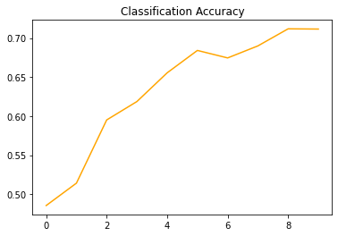

```python
# CNN for classification task 
from tensorflow import keras
from keras.models import Sequential
from keras.layers import Dense, Flatten, Dropout, BatchNormalization
from keras.layers import Conv2D, MaxPooling2D
import numpy as np
from PIL import Image
from IPython.display import display
import cv2
```


```python
(x_train, y_train), (x_test, y_test) = keras.datasets.cifar10.load_data()
print("Training dataset images shape: " +str(x_train.shape))
print("Training dataset labels shape: " +str(y_train.shape))
print()
print("Test dataset images shape: " +str(x_test.shape))
print("Test dataset labels shape: " +str(y_test.shape))
```

    Training dataset images shape: (50000, 32, 32, 3)
    Training dataset labels shape: (50000, 1)
    
    Test dataset images shape: (10000, 32, 32, 3)
    Test dataset labels shape: (10000, 1)
    


```python
#RGB image 32x32x3
test_images_ids= [1, 32, 4353, 4343, 93]
for i in test_images_ids:
  test_image = x_train[i]
  test_image_object = Image.fromarray(test_image)
  print("Train image id:"+str(i))
  display(test_image_object)
  test_image = cv2.resize(test_image,(256,256))
  test_image= Image.fromarray(test_image)
  display(test_image)
  print("Label:" +str(y_train[i]))
```

    Train image id:1
    


    

    


    

    


    Label:[9]
    Train image id:32
    


    

    


    

    


    Label:[1]
    Train image id:4353
    


    

    


    

    


    Label:[0]
    Train image id:4343
    


    

    


    

    


    Label:[8]
    Train image id:93
    


    

    


    

    


    Label:[0]
    


```python
num_classes = 10 
y_train_onehot= keras.utils.to_categorical(y_train,num_classes)
y_test_onehot= keras.utils.to_categorical(y_test,num_classes)
for i in test_images_ids:
  print("label of the first example before one-hot encoding"+str(y_train[i]))
  print("label of the firest training example after one-hot encoding"+str(y_train_onehot[i]))
```

    label of the first example before one-hot encoding[9]
    label of the firest training example after one-hot encoding[0. 0. 0. 0. 0. 0. 0. 0. 0. 1.]
    label of the first example before one-hot encoding[1]
    label of the firest training example after one-hot encoding[0. 1. 0. 0. 0. 0. 0. 0. 0. 0.]
    label of the first example before one-hot encoding[0]
    label of the firest training example after one-hot encoding[1. 0. 0. 0. 0. 0. 0. 0. 0. 0.]
    label of the first example before one-hot encoding[8]
    label of the firest training example after one-hot encoding[0. 0. 0. 0. 0. 0. 0. 0. 1. 0.]
    label of the first example before one-hot encoding[0]
    label of the firest training example after one-hot encoding[1. 0. 0. 0. 0. 0. 0. 0. 0. 0.]
    


```python
from keras.backend import categorical_crossentropy
# Model Definition
def NN_Model():
  model = Sequential()
  # add layer  
  # (conv2d(feature_maps,kernel_size)
  model.add(Conv2D(64,kernel_size=3,activation="relu",input_shape=(32,32,3), padding='same'))
  model.add(Conv2D(64,kernel_size=3,activation="relu", padding='same'))
  model.add(MaxPooling2D(pool_size=(2,2)))
  #Flatten the produced feature maps and make a single row vector
  model.add(Conv2D(256,kernel_size=3,activation="relu", padding='same'))
  model.add(Conv2D(256,kernel_size=3,activation="relu", padding='same'))
  model.add(MaxPooling2D(pool_size=(2,2)))

  model.add(Conv2D(256,kernel_size=3,activation="relu", padding='same'))
  model.add(Conv2D(256,kernel_size=3,activation="relu", padding='same'))
  model.add(MaxPooling2D(pool_size=(2,2)))
  model.add(Flatten())
  #Add the neurons of the weights
  model.add(Dense(100,activation='relu'))
  #Add output layer
  model.add(Dense(10,activation='softmax'))

  #It is suitable for classifiers that use softmax output (cost function is cattegorical cross entropy type)
  model.compile(loss=keras.losses.CategoricalCrossentropy(), optimizer=keras.optimizers.Adam(learning_rate=0.0001), metrics=['accuracy'])  #optimizer is the algorithm that is used to update the DEnse layer of the weights
  #Adam is a variation of gradient decend optimizer. Specifically we update the number of 
  #training images in batches, We use Adam optimizer to add up the output loss values and 
  #Then we look only on the first batch and we update the weight based on the added loss of the first batch
  # So we have localized the training in batches and then we have trained one epoch.
  #model.compile(loss=keras.losses.CategoricalCrossentropy(), optimizer=keras.optimizers.SGD(learning_rate=0.0001,momentum=0.002), metrics=['accuracy'])  #optimizer is the algorithm that is used to update the DEnse layer of the weights
  # Steepest descent performs really bad in this kind of application
  return model

```


```python

```


```python
#model_4 = NN_Model()
#model_4.summary()

```


    ---------------------------------------------------------------------------

    AttributeError                            Traceback (most recent call last)

    <ipython-input-72-d94c4d5edb6e> in <module>
    ----> 1 model_4 = NN_Model()
          2 model_4.summary()
    

    <ipython-input-70-133ce676cd88> in NN_Model()
         23 
         24   #It is suitable for classifiers that use softmax output (cost function is cattegorical cross entropy type)
    ---> 25   model.compile(loss=keras.losses.CategoricalCrossEntropy(), optimizer=keras.optimizers.Adam(learning_rate=0.0001), metrics=['accuracy'])  #optimizer is the algorithm that is used to update the DEnse layer of the weights
         26   #Adam is a variation of gradient decend optimizer. Specifically we update the number of
         27   #training images in batches, We use Adam optimizer to add up the output loss values and
    

    AttributeError: module 'keras.api._v2.keras.losses' has no attribute 'CategoricalCrossEntropy'


```python
model_5 = NN_Model()
model_5.summary()
```

    Model: "sequential_16"
    _________________________________________________________________
     Layer (type)                Output Shape              Param #   
    =================================================================
     conv2d_75 (Conv2D)          (None, 32, 32, 64)        1792      
                                                                     
     conv2d_76 (Conv2D)          (None, 32, 32, 64)        36928     
                                                                     
     max_pooling2d_38 (MaxPoolin  (None, 16, 16, 64)       0         
     g2D)                                                            
                                                                     
     conv2d_77 (Conv2D)          (None, 16, 16, 256)       147712    
                                                                     
     conv2d_78 (Conv2D)          (None, 16, 16, 256)       590080    
                                                                     
     max_pooling2d_39 (MaxPoolin  (None, 8, 8, 256)        0         
     g2D)                                                            
                                                                     
     conv2d_79 (Conv2D)          (None, 8, 8, 256)         590080    
                                                                     
     conv2d_80 (Conv2D)          (None, 8, 8, 256)         590080    
                                                                     
     max_pooling2d_40 (MaxPoolin  (None, 4, 4, 256)        0         
     g2D)                                                            
                                                                     
     flatten_16 (Flatten)        (None, 4096)              0         
                                                                     
     dense_32 (Dense)            (None, 100)               409700    
                                                                     
     dense_33 (Dense)            (None, 10)                1010      
                                                                     
    =================================================================
    Total params: 2,367,382
    Trainable params: 2,367,382
    Non-trainable params: 0
    _________________________________________________________________
    


```python
epoch = 10
batch_size = 256
history_4 = model_4.fit(x_train,y_train_onehot, batch_size=batch_size, epochs=epoch,verbose=1, validation_data=(x_test,y_test_onehot))
```


```python
epoch = 10
batch_size = 256
history_5 = model_5.fit(x_train,y_train_onehot, batch_size=batch_size, epochs=epoch,verbose=1, validation_data=(x_test,y_test_onehot))
```

    Epoch 1/10
    196/196 [==============================] - 47s 235ms/step - loss: 2.0844 - accuracy: 0.3434 - val_loss: 1.4518 - val_accuracy: 0.4854
    Epoch 2/10
    196/196 [==============================] - 15s 75ms/step - loss: 1.3452 - accuracy: 0.5230 - val_loss: 1.3886 - val_accuracy: 0.5141
    Epoch 3/10
    196/196 [==============================] - 15s 76ms/step - loss: 1.1519 - accuracy: 0.6001 - val_loss: 1.1548 - val_accuracy: 0.5951
    Epoch 4/10
    196/196 [==============================] - 15s 74ms/step - loss: 0.9836 - accuracy: 0.6619 - val_loss: 1.0977 - val_accuracy: 0.6187
    Epoch 5/10
    196/196 [==============================] - 14s 74ms/step - loss: 0.8669 - accuracy: 0.7034 - val_loss: 0.9850 - val_accuracy: 0.6555
    Epoch 6/10
    196/196 [==============================] - 14s 74ms/step - loss: 0.7559 - accuracy: 0.7407 - val_loss: 0.9274 - val_accuracy: 0.6842
    Epoch 7/10
    196/196 [==============================] - 14s 74ms/step - loss: 0.6685 - accuracy: 0.7737 - val_loss: 0.9554 - val_accuracy: 0.6746
    Epoch 8/10
    196/196 [==============================] - 15s 74ms/step - loss: 0.5883 - accuracy: 0.8030 - val_loss: 0.9202 - val_accuracy: 0.6900
    Epoch 9/10
    196/196 [==============================] - 15s 75ms/step - loss: 0.5034 - accuracy: 0.8319 - val_loss: 0.8855 - val_accuracy: 0.7119
    Epoch 10/10
    196/196 [==============================] - 15s 75ms/step - loss: 0.4238 - accuracy: 0.8598 - val_loss: 0.9109 - val_accuracy: 0.7116
    


```python
import matplotlib.pyplot as plt
plt.title('Classification Accuracy')
#plt.plot(history_3.history['val_accuracy'],color='orange',label='test-with-Adam_optimizer')
#plt.plot(plt.plot(history_4.history['val_accuracy'],color='orange',label='test'))
plt.plot(history_5.history['val_accuracy'],color='orange',label='test')
```


    [<matplotlib.lines.Line2D at 0x7f928409d690>]


    

    


```python
prediction=model_3.predict(x_train)
prediction
display(prediction)
```
